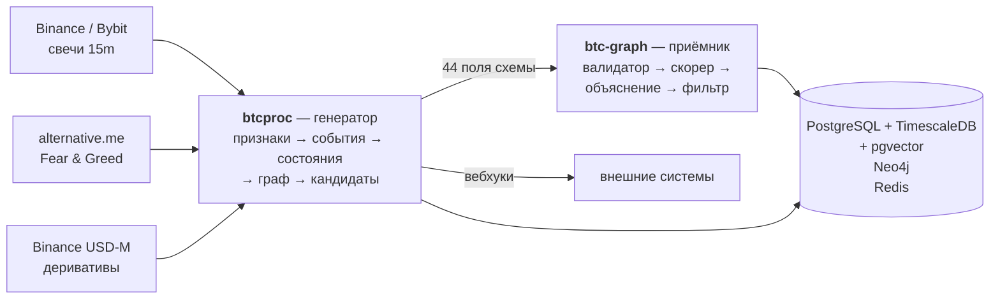

# Глава 1. Что это за система и зачем она

> **Кратко.** Система размечает историю крипторынка на несколько десятков
> «состояний», строит граф переходов между ними и на каждом переходе выпускает
> **кандидата** — досье об исторической аналогии. Исходная гипотеза («если
> раньше после такой конфигурации чаще росло, то и впредь будет чаще расти»)
> была проверена на отложенной части истории и **не подтвердилась**. То, что
> осталось после проверки, — описательный инструмент плюс один измеренно
> работающий прогноз про ширину хода. Эта глава объясняет, как система пришла
> к такому положению и почему это следует считать успехом, а не провалом.

---

## 1.1. Исходная задача

Начиналось всё с технического задания
(`btc-graph/README_agent_spec.md`), которое описывало ИИ-агента. Агенту на
вход приходит «кандидат» — структура из 37 полей, описывающая рыночную
ситуацию и её историческую статистику:

```
Такая конфигурация рынка встречалась 1339 раз.
В 74% случаев за следующие 24 часа цена шла вверх.
Конфигурация: переход из состояния 42 в состояние 1,
сопровождённый блоком событий event_block_004417.
Контекст свежий, состояние держится 18 минут,
траектория входа — низкоэнтропийная.
```

Агент должен был такое досье провалидировать, оценить по четырём осям
качества, объяснить человеческим языком, отфильтровать поток от дубликатов и
найти противоречия («по одному переходу пришли два кандидата, один вверх,
другой вниз»).

Откуда берутся кандидаты, ТЗ не уточняло — источник считался данностью.
В реальности его пришлось построить целиком, и он оказался примерно половиной
всего кода. Так и появились два сервиса вместо одного.

### Что за «состояния»

Идея, вокруг которой всё выстроено, простая. Рынок в каждый момент времени
описывается вектором чисел: где цена относительно скользящих средних, насколько
широкие бары, много ли объёма, перекуплен ли RSI на четырёх таймфреймах сразу.
Этот вектор — точка в 32-мерном пространстве. Точки не размазаны по
пространству равномерно: они собираются в облака. Облако — это «состояние
рынка», режим, в котором рынок какое-то время живёт.

Дальше история превращается в **последовательность состояний**:

```
… 1 1 1 1 4 4 4 4 4 2 2 2 2 2 2 10 10 2 2 2 …
```

А из последовательности — в **граф**: состояния становятся узлами, смены
состояния — рёбрами. Момент смены состояния — это событие, вокруг которого и
строится кандидат: «рынок только что перешёл 4→1; посмотрим, чем такие переходы
кончались раньше».

Почему граф, а не что-то другое, — глава 3.

---

## 1.2. Что построено

На 2026-08-21 система состоит из двух сервисов в одном репозитории.



**Генератор** (`btc-graph-processing`, пакет `btcproc`) качает свечи с двух
бирж с 2017 года, считает 32 признака, детектирует 53 типа событий, находит
состояния рынка адаптивной кластеризацией, строит граф переходов, размечает
исходы на горизонте 24 часа и выпускает кандидатов.

**Приёмник** (`btc-graph`, пакет `src`) валидирует кандидата, считает
`quality_score` ∈ [0, 1] по четырём осям, присваивает рейтинг
STRONG / MODERATE / WEAK, генерирует объяснение (детерминированно либо через
Claude), фильтрует слабых и дубликаты, сохраняет в три хранилища.

Масштаб на дату написания:

| Метрика | Значение |
|---|---|
| Рабочего кода | ≈ 23 400 строк |
| Тестов | ≈ 13 500 строк |
| Документации и журналов решений | ≈ 30 700 строк |
| Торговых пар | 6, на двух биржах |
| Глубина истории | до 315 422 баров 15m на монету (BTCUSDT, с 2017-08-17) |
| Оценённых кандидатов в локальной базе | 78 381 |

Обратите внимание на соотношение кода, тестов и документации. Оно не случайно:
система целиком построена вокруг тезиса «числа могут оказаться неправильными,
не сломав ничего заметного», и защита от этого класса ошибок стоит примерно
столько же, сколько сама функциональность.

---

## 1.3. Гипотеза и её проверка

ТЗ строилось на непроверенном предположении:

> Если конфигурация рынка в прошлом в 74% случаев кончалась ростом, то и впредь
> будет чаще кончаться ростом.

Всё остальное в ТЗ — механика вокруг этой гипотезы. Проект гипотезу проверил,
и это главное содержательное событие в его истории.

### Как проверяли (2026-08-12, `make validate-holdout`)

Модель состояний обучалась на первых 70% истории монеты. Кандидаты выпускались
на оставшихся 30%, которых модель не видела вовсе. Дополнительно: карты
редкости переходов и статистика блоков событий тоже считались только по
обучающей части — иначе кандидат из holdout получал бы оценку, зависящую от
того, чем этот holdout закончился.

Считалось четыре вещи:

1. **Directional accuracy** — доля кандидатов, у которых заявленная сторона
   совпала с фактическим исходом. Нулевая гипотеза: 0.5.
2. **Парное сравнение с «всегда long»** — потому что 0.5 недостаточно: если за
   период holdout рынок рос, стратегия «всегда вверх» даст accuracy сильно выше
   половины, ничего не зная.
3. **Brier score** против константного прогноза (базовая частота).
4. **Различает ли рейтинг** — accuracy STRONG против accuracy WEAK.

Значимость считалась блочным бутстрапом, а не наивным z-тестом: наблюдения
зависимы (горизонт 24 часа — это 96 баров, кандидаты идут чаще), и наивная
арифметика завышает уверенность примерно втрое.

### Результат

Шесть замеров из шести — три монеты × две модели состояний:

| Показатель | Результат | Идеал |
|---|---|---|
| Directional accuracy | 0.497–0.516, ДИ накрывают 0.5 | > 0.5 значимо |
| Против «всегда long» | неотличимо | значимо положительно |
| Brier skill | отрицателен | положителен |
| Наклон калибровки | 0.02–0.07 | 1.0 |
| STRONG против WEAK | не отличается ни разу | STRONG лучше |

Проверено на горизонтах 24h, 8h, 4h и 1h — одинаково.

### Вторая проверка: виноват ли граф?

Оставался разумный вопрос: может, сигнал в признаках есть, а дискретизация в
несколько десятков состояний его съедает? Граф — это ведь потеря информации по
построению.

Проверили контрольной моделью (2026-08-13, `make control-model`): градиентный
бустинг на **тех же** 32 признаках, с **той же** целевой, на **том же**
разбиении истории, с purged walk-forward CV — и без всякого графа. Причём
контрольная модель честнее проверяемой системы: деревьям безразличен масштаб,
поэтому у неё нет даже того остаточного заглядывания вперёд, которое есть в
боевом расчёте признаков.

Критерий не прошёл ни на одной из четырёх монет: AUC 0.504–0.536, Brier skill
отрицателен у трёх из четырёх, у BTCUSDT разница с «всегда long» значимо
**отрицательна**.

Интерпретация была объявлена заранее, до запуска, в виде таблицы:

| Бустинг на признаках | Граф состояний | Вывод |
|---|---|---|
| нет сигнала | нет сигнала | **потолок в признаках**; граф ни при чём |
| есть сигнал | нет сигнала | потеря на дискретизации; узкое место — граф |
| нет сигнала | есть сигнал | почти невозможно; искать протечку |

Выпала первая строка. Отсюда следует практический вывод, определяющий всю
дальнейшую работу проекта: **доводить структуру графа как способ найти сигнал
бессмысленно**. Менять надо источники данных или предмет предсказания.

---

## 1.4. Отрицательный результат как продукт

Здесь стоит остановиться, потому что это редкая для отрасли ситуация.

Обычный путь такого проекта: гипотеза → реализация → бэктест на всей истории →
красивые числа → продукт → потеря денег в бою → «рынок изменился». Ключевая
подмена происходит на бэктесте: если модель училась и проверялась на одних и
тех же данных, а зависимость наблюдений не учитывалась, то впечатляющие числа
получаются почти всегда — они и есть свойство процедуры, а не рынка.

Здесь получилось иначе, и вот за счёт чего.

**Критерий объявлялся письменно до запуска.** Не «посмотрим, что получится», а
«сигнал есть означает: accuracy значимо выше 0.5 И парная разница с бенчмарком
значимо положительна И Brier skill положителен — на двух монетах из трёх и на
двух зёрнах». Такой критерий нельзя подвинуть после того, как увидел числа.

**Бенчмарк всегда нетривиальный.** Не «лучше нуля», а «лучше того, что уже
есть»: для направления — «всегда long», для размаха — «недавняя волатильность
плюс время суток». Половина эффектов, которые проект видел за две недели,
исчезала при замене нулевого бенчмарка на честный.

**Значимость считается методом, устойчивым к зависимости.** Блочный бутстрап
везде, общим кодом, — см. главу 12. Наивный z-тест печатается рядом, чтобы
разница была видна глазами.

**Результат требует воспроизведения.** Две монеты из трёх, две модели, два
зерна. Одиночное подтверждение результатом не считается.

Итог: направление закрыто за две недели собственными средствами проверки, а не
за год работы и чужие деньги в рынке. Это и есть главный актив проекта —
способность быстро и честно закрывать направления. Через тот же механизм прошли
три внешних источника данных (Smart Money, Fear & Greed, деривативы Binance), и
все три были отвергнуты как источник сигнала.

---

## 1.5. Что нашлось взамен

Тот же аппарат перенаправили с вопроса «куда пойдёт цена» на вопрос «насколько
широко она сходит». Здесь картина оказалась обратной.

**Признаки предсказывают размах.** Те же 32 признака дают +0.03…+0.10
out-of-sample R² сверх тривиального бенчмарка на трёх монетах с длинной
историей, на всех трёх горизонтах и при обеих нормировках цели. Критерий был
заявлен до прогона и пройден.

**Разметка графа этого почти не сохраняет.** На горизонте 4h `group_id` и
`event_block_id` дают 0–10% от того же приращения. Это первый случай, когда
сработала вторая строка таблицы из раздела 1.3 — «есть сигнал в признаках, нет
в графе». Но относится он к размаху, а не к направлению.

**Самый устойчивый предиктор в проекте — календарь.** Час дня двумя гармониками
и день недели, без единой рыночной величины, объясняют 0.055–0.187 дисперсии
размаха на всех шести монетах. Это больше, чем все три заведённых внешних
источника вместе. Практическое следствие сформулировано жёстко: любой будущий
продукт про волатильность обязан меряться относительно календаря — иначе он
продаёт время суток под видом анализа рынка.

**Построен квантильный регрессор размаха** (глава 13). Критерий из трёх условий
— приращение R², превосходство по ранжированию, калибровка квантилей — заявлен
до запуска и пройден на четырёх монетах с историей от пяти лет. Это первая
конструкция проекта с положительным вердиктом на отложенной части. Она внесена
в конвейер: обучается в `train`, применяется в `live`, её числа доезжают до
кандидата полями `expected_range_ratio_p50/p90`, `range_lift`, `range_regime`.

Причём честно помонетно: TAOUSDT и HYPEUSDT гейт калибровки не прошли, и их
модели чисел наружу не отдают вовсе.

Заметьте, что это возврат к самому амбициозному пункту исходного ТЗ —
«вероятностный диапазон цены». Только в масштабе часов и по величине, которая
действительно предсказуема.

---

## 1.6. Три принципа, на которых стоит вся конструкция

Эти принципы упоминаются в каждой главе, поэтому их стоит проговорить сразу.

### Принцип 1: генератор считает, приёмник оценивает

**btcproc считает статистику и не решает, что хорошо. btc-graph оценивает и
фильтрует, но ничего не вычисляет заново.**

Граница жёсткая. Генератор не знает слов STRONG и WEAK; приёмник не умеет
считать признаки и не имеет доступа к барам. Между ними — контракт из 44 полей,
единственный источник истины по которому — pydantic-модель `Candidate` в
`btc-graph/src/models/candidate.py`. Генератор её не дублирует, а импортирует в
тесте совместимости.

Зачем: порог «выборка больше 1000 случаев — это хорошо» откалиброван под рынок
с десятилетней историей. Для монеты с годом торгов та же линейка означает «всё
слабое». Это свойство линейки, а не рынка, и оно обязано жить отдельно от
расчёта, чтобы его можно было менять, не трогая статистику.

### Принцип 2: LLM только формулирует

Внутри приёмника действует тот же принцип этажом ниже. `quality_score`,
`rating`, `direction`, `win_rate` считает детерминированный код. Claude
получает уже готовые числа и пишет только `strengths`, `risks`, `summary`.

Следствия:
- одинаковый вход всегда даёт одинаковый балл;
- `use_llm=false` даёт полностью валидный результат — без API-ключа, мгновенно
  и бесплатно;
- сбой Anthropic API не останавливает работу: `llm_node` падает на
  детерминированный `src/agent/deterministic.py`, где те же тексты собираются
  по if-правилам.

### Принцип 3: величина, неизменная после прогона, считается один раз

Разметка завершённого `train` не меняется — значит всё, что из неё выводится,
вычислять при чтении незачем. Правило появилось после того, как пять кликов по
узлу графа в админке уложили боевую базу: агрегат «фон состояния» считался в
обработчике join'ом всей истории монеты с разворачиванием массивов атомов.

Теперь такие величины считает `train` и кладёт в таблицу (`state_context`), а
страница читает готовое. Кэш в памяти процесса эту роль не выполняет: он
заполняется после первого ответа, а одновременные запросы уходят в базу до
того.

---

## 1.7. Чего система не делает

Список короткий, но важный: каждый пункт — граница, за которую заходить нельзя.

**Не предсказывает направление.** Измерено дважды, независимыми способами.

**Не даёт торговых сигналов.** У кандидата нет entry timing, стопов, размера
позиции, портфельного контекста. Это описание исторической аналогии.

**Не сравнивает монеты по `quality_score`.** Профильный балл ранжирует
кандидатов внутри монеты. Для межмонетного сравнения существует отдельное число
— `quality_score_baseline`, посчитанное неподвижной общей меркой.

**Не сравнивает `group_id` между монетами и между прогонами.** Модель состояний
обучается на каждую монету отдельно и перенумеровывает состояния при каждом
обучении. «Состояние 7» у BTC и у ETH — разные рынки; «состояние 7» вчера и
сегодня — тоже.

**Не считает число состояний характеристикой рынка.** Отбрасывание 50 баров из
314 000 (0.016% истории) меняет 40 состояний на 46. Хаос живёт в процедуре:
стартовое разбиение MiniBatchKMeans чувствительно к малым изменениям данных, а
рекурсия усиливает каждый перевёрнутый выбор во всё поддерево. Сравнивать графы
двух прогонов по числу узлов бессмысленно, и «стало больше состояний» —
не диагноз.

**Не считает шесть монет шестью независимыми наблюдениями.** BTC, ETH и SOL
коррелированы выше 0.8. Расширение списка монет ради «подтвердилось на трёх из
трёх» запрещено внутренними правилами проекта.

---

## 1.8. Что осталось незакрытым

Честный список долгов на дату написания.

**Остаточное заглядывание вперёд в боевом расчёте.** Нормировка признаков
(`robust_scale_params` — медиана и IQR по всей истории) и карты редкости
переходов считаются по всей выборке, включая будущее относительно конкретного
бара. Внутри проверочных замеров это закрыто (`holdout.prefix_maps`), в боевом
расчёте — нет. На сегодняшние выводы не влияет: честный расчёт их только
ухудшит. Но любой будущий положительный результат придётся перепроверять с
закрытой протечкой.

**Разрыв между «измерено» и «показано».** Прогноз размаха считается и доезжает
до кандидата, но в интерфейсе его нет. Это самый крупный незакрытый долг, и он
не технический, а приоритетный.

**API без аутентификации и rate-limit.** Допустимо только потому, что API не
выставлен наружу.

**Таблица `market_events`** создана миграцией и кодом не используется.

**Эксплуатация усложнилась.** Шесть монет — шесть линеек с версиями и
отпечатками, и еженедельное переобучение модели состояний молча обесценивает
калибровку приёмника. Обнаружено, задокументировано, автоматической проверки
пока нет.

---

## 1.9. Резюме главы

Система родилась из гипотезы о направленном предсказании, проверила её честно и
получила отрицательный ответ. Механика при этом реализована целиком и
работает — часть исходного ТЗ живёт в коде дословно, вплоть до пороговых чисел
и эталонного примера, защищённых автотестами.

То, что осталось: описательный инструмент для разметки истории («сжатие
волатильности у верхней границы месячного диапазона» — имя состояния, выведенное
из статистики, а не назначенное вручную), граф переходов как язык описания
рынка, поток исторических аналогий с оценкой качества, и один измеренно
работающий прогноз про ширину хода.

Следующая глава разбирает, как эти части соединены между собой.
