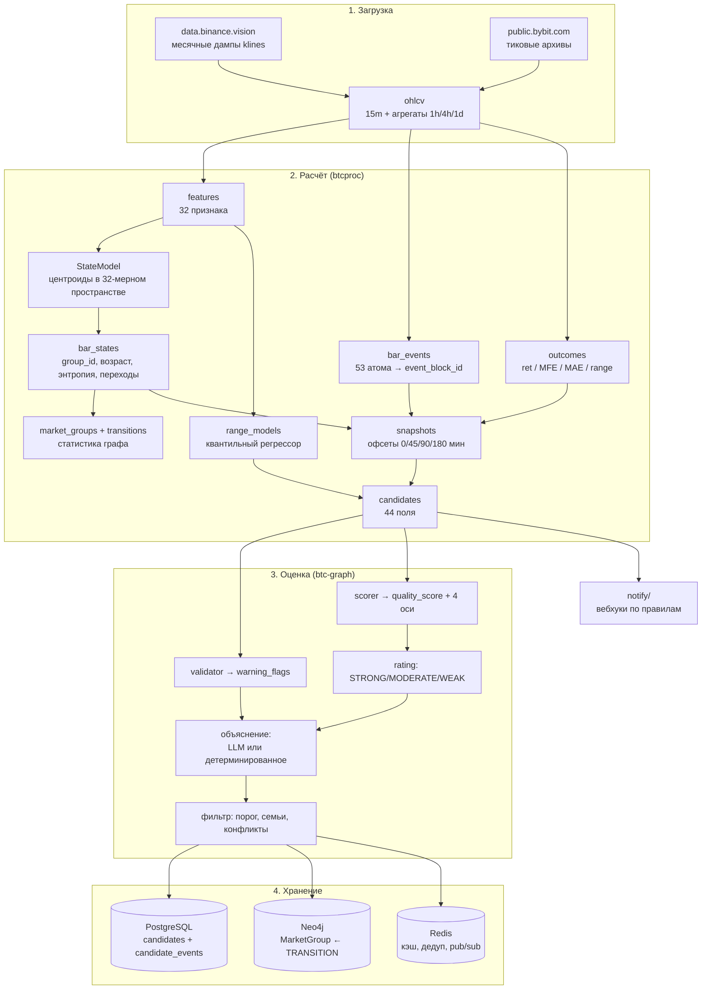

# Глава 2. Архитектура: два сервиса и один контракт

> **Кратко.** Система — это два независимых Python-пакета в одном репозитории,
> разделённые контрактом из 44 полей, и четыре общих хранилища. Внутри каждого
> сервиса — линейный конвейер без обратных связей. Эта глава показывает, где
> проходят границы, как данные текут через систему и какие ловушки живут на
> стыках.

---

## 2.1. Карта репозитория

```
crypto-graph/
├── btc-graph/                  ПРИЁМНИК, пакет `src`
│   ├── src/
│   │   ├── models/candidate.py     ← единственный источник истины по схеме
│   │   ├── parser/                 сырой текст / JSON / dict → Candidate
│   │   ├── validator/              warning_flags, без исключений
│   │   ├── scorer/                 4 оси → quality_score
│   │   ├── config/profiles.py      профили монет: вся калибровка
│   │   ├── agent/                  pipeline, llm_node, deterministic
│   │   ├── filters/                порог, семьи, конфликты
│   │   ├── db/                     PostgreSQL, Neo4j, эмбеддинги
│   │   ├── cache/                  Redis
│   │   ├── api/                    FastAPI
│   │   └── worker/                 Celery
│   ├── config/symbols/*.yaml       ← профили = whitelist монет
│   ├── alembic/versions/           миграции PostgreSQL
│   └── docker-compose.yml          ← вся инфраструктура живёт здесь
│
├── btc-graph-processing/       ГЕНЕРАТОР, пакет `btcproc`
│   ├── btcproc/
│   │   ├── config.py               единственное место чтения окружения
│   │   ├── symbols.py              реестр монет
│   │   ├── ingest/                 Binance, Bybit, внешние ряды, деривативы
│   │   ├── features/               индикаторы, 32 признака, 53 атома
│   │   ├── states/                 кластеризация, разметка, граф, имена
│   │   ├── candidates/             исходы, сборка кандидата
│   │   ├── analysis/               замеры: лифт, holdout, контроль, размах
│   │   ├── pipeline/               train, live
│   │   ├── sink/                   доставка в btc-graph
│   │   ├── notify/                 вебхуки наружу
│   │   ├── admin/                  веб-интерфейс, 9 страниц
│   │   ├── hostmon/                монитор машины → Telegram
│   │   └── db/                     schema.sql, psycopg2, repo, runs
│   └── docker-compose.yml          только админка, во внешнюю сеть
│
├── docs/                       сквозные документы: ТЗ, аудиты, планы, эта книга
└── deploy/                     два скрипта развёртывания на VPS
```

Один репозиторий, две истории — до 2026-08-13 подпроекты жили порознь, потом
их истории втянули сюда целиком с переписанными путями. `git log` и `git blame`
по файлам подпроектов работают нативно.

### Почему пакеты называются по-разному

Пакет приёмника называется `src`, генератора — `btcproc`. Это не стиль, а
условие работоспособности основного режима доставки: генератор добавляет
каталог приёмника в `sys.path` и вызывает его код напрямую. Если бы оба пакета
назывались `src`, ленивые импорты приёмника (`from src.db.connection import …`
внутри функции сохранения) резолвились бы в код генератора.

> ⚠️ **Ломается молча.** Переименование любого из двух пакетов ломает режим
> `direct` неочевидным образом — кандидаты будут считаться, отправка отрапортует
> об успехе, а записи не появятся.

---

## 2.2. Поток данных целиком



Конвейер линейный. Обратных связей нет нигде: оценка приёмника не влияет на то,
как генератор считает следующего кандидата, а `quality_score` не участвует в
построении графа. Единственное исключение — Neo4j хранит `avg_quality_score` на
ребре, но это накопительная статистика для чтения, в расчёт она не возвращается.

---

## 2.3. Контракт: схема кандидата

44 поля, сгруппированные по смыслу. Полный справочник — приложение 19.1; здесь
только структура и логика.

| Группа | Полей | Что описывает |
|---|---|---|
| **Identity** | 5 | `candidate_id`, `symbol`, `configuration_hash`, `candidate_family_key`, `research_score` |
| **State / Trajectory** | 7 | откуда и куда перешёл рынок, возраст состояния, свежесть, энтропия траектории, редкость перехода |
| **Event context** | 8 | блок событий, его редкость, интенсивность, доля в истории |
| **Historical sample** | 10 | размер выборки (два числа), на что она обусловлена, валидность меток, повторяемость по дням и месяцам, сезонная концентрация |
| **Outcome profile** | 6 | доля роста, перекос, счётчики, сторона |
| **Favorable / adverse** | 4 | перцентили пути «хорошего» случая для обеих сторон |
| **Range profile** | 4 | квантили размаха, `range_lift`, режим |

Три свойства контракта, которые стоит знать.

**Единственный источник истины — pydantic-модель приёмника.** Генератор её не
копирует, а импортирует в тесте
`test_generated_candidates_match_btc_graph_schema`: каждый выпущенный кандидат
обязан пройти валидацию чужой модели без правок.

**Все новые поля Optional с дефолтом None.** Схема выросла с 37 полей до 44 за
две недели: добавились `effective_sample_size`, `sample_scope`,
`short_favorable_adverse_ratio_p70_p80` и четыре поля размаха. Старые выгрузки
продолжают проходить валидацию, а `None` означает «не знаем» — и это не то же
самое, что ноль. Правило соблюдается везде: критерий без данных **выбывает** из
усреднения, а не начисляет ноль баллов.

**Служебные поля не уходят.** У кандидата внутри генератора есть `_meta`
(временная метка, номер офсета, средняя доходность выборки); `strip_meta()`
вырезает его перед отправкой. Приёмник времени кандидата не знает вовсе — это,
кстати, причина, по которой выгрузка для калибровки обязана идти
`ORDER BY ts`: скрипт доверяет порядку строк.

### Три идентификатора и почему в каждом есть символ

```python
candidate_id       = sha1(symbol, ts, transition_id, event_block_id, offset)[:20]
configuration_hash = sha1(symbol, transition_id, event_block_id,
                          age_bucket, entropy)[:16]
candidate_family_key = f"{symbol}|{group}|{transition}|{block}|{bias}|{side}"
```

`transition_id`, `event_block_id` и `group_id` — номера внутри графа **одной
монеты**. Модель состояний обучается на каждую монету отдельно, поэтому «42→1»
у BTC и у ETH — разные переходы.

> ⚠️ **Ломается молча.** Без символа в `configuration_hash` приёмник отдаст ETH
> готовую оценку BTC: он дедуплицирует по хэшу с TTL 30 минут. Кандидат при этом
> выглядит нормально оценённым — по данным это не диагностируется никак.
> Регрессии стоят с обеих сторон: `test_configuration_hash_includes_symbol` и
> `test_dedup_does_not_leak_between_symbols`.

Разница между `candidate_id` и `configuration_hash` существенна:
`configuration_hash` описывает **конфигурацию рынка**, и под одним хэшем могут
идти разные кандидаты. Поэтому кэш оценок отдаётся только при совпадении
`candidate_id` — иначе клиент получал бы чужую оценку.

---

## 2.4. Три режима доставки

`btcproc/sink/graph_sink.py`, переменная `SINK_MODE`:

**`direct`** (рабочий). Каталог приёмника добавляется в `sys.path`,
переменные окружения `DATABASE_URL`, `REDIS_URL`, `USE_DB`, `USE_REDIS`,
`USE_GRAPH` выставляются **до** первого импорта (приёмник читает флаги на уровне
модуля), затем вызывается `run_batch_pipeline(save=True)`. Никакого HTTP,
никакой сериализации — прямой вызов функции в том же процессе.

**`http`** (запасной). `POST /queue/enqueue` на `BTC_GRAPH_URL`. Кандидат
попадает в Redis Stream, Celery Beat каждые 10 секунд забирает пачку и
раздаёт воркерам.

**`none`** — считать без отправки. Нужен для замеров и обкатки новой монеты.

Кандидаты дублируются в `processing.candidates` намеренно: приёмник принимает
только прошедших фильтр, а для разбора нужен полный список. Оценки, вернувшиеся
из приёмника, дописываются в ту же строку.

### Ловушка разъезда интерпретаторов

В режиме `direct` пакеты `pgvector` и `neo4j` импортирует **чужой** код и делает
это лениво, уже внутри сохранения.

> ⚠️ **Ломается молча.** Если этих пакетов нет в интерпретаторе, из которого
> запущен генератор, кандидаты считаются, отправка рапортует об успехе, а
> записей нет — в логе `ModuleNotFoundError` посреди прогона. Проверка:
> `python3 -m btcproc.cli status` печатает путь к интерпретатору и наличие
> пакетов.

---

## 2.5. Два пути обработки внутри приёмника

**Синхронный.** `POST /evaluate/json` → `run_pipeline()` → ответ с оценкой.
Один кандидат, ответ сразу.

**Асинхронный.** `POST /queue/enqueue` → Redis Stream `candidates:stream` →
Celery Beat раз в 10 секунд запускает `process_stream_batch` (`XREADGROUP` по
группе `candidates:workers`, затем `XACK` + `XDEL`) → `.delay()` на каждого →
очередь **`evaluate`** → воркеры.

> ⚠️ **Ломается молча.** Celery-воркер обязан слушать `-Q evaluate,celery`.
> `task_routes` шлёт задачу `evaluate_candidate` в очередь `evaluate`; без явного
> `-Q` задачи копятся в Redis без единой ошибки.

**Батчевый.** `run_batch_pipeline()` — то, чем пользуется режим `direct`.
Отличается не только объёмом:

1. профили резолвятся **один раз** для всего батча, до первой оценки;
2. фильтр считает `score_and_filter` для всех, разбивки переиспользуются в
   `_evaluate` (у монеты со своим профилем скоринг двухпроходный — профильный
   плюс baseline, и повторять его выжившим значит делать двойную работу);
3. `select_best_per_family` оставляет по одному кандидату на семью;
4. запись идёт пачками по 500 в каждое из трёх хранилищ.

Почему профиль резолвится один раз: `POST /config/reload` посреди батча дал бы
кандидата, у которого `score` посчитан одной версией калибровки, а `rating` и
тексты — другой.

---

## 2.6. Контракт деградации хранилищ

Правило: **недоступное хранилище не ломает оценку, но обязательно логируется и
попадает в статус.**

```python
status: dict[str, bool | None] = {"db": None, "graph": None, "redis": None}
# True  — записано
# False — сбой (залогирован через logger.exception)
# None  — отключено через USE_DB / USE_GRAPH / USE_REDIS
```

Никакого `except: pass` вокруг хранилищ нет нигде — это явное правило проекта.
В батчевом пути у каждого хранилища свой `try`, и при сбое пачки идёт откат **на
поштучную запись именно в это хранилище**, а не общий повтор: тот переписал бы
заодно два уже отработавших, а для Neo4j повтор — это двойной инкремент
счётчиков.

Транзакция Neo4j на всю пачку атомарна: раз она не прошла, не применилось
ничего, и поштучный повтор безопасен.

---

## 2.7. Инфраструктура

Вся принадлежит приёмнику, поднимается его `docker-compose.yml`:

| Сервис | Образ | Порт | Роль |
|---|---|---|---|
| `postgres` | `timescale/timescaledb-ha:pg16` | 5432 | основное хранилище, TimescaleDB + pgvector |
| `redis` | `redis:7-alpine` | 6379 | кэш, дедуп, очередь, pub/sub |
| `neo4j` | `neo4j:5` | 7474 / 7687 | граф состояний |
| `api` | свой | 8000 | FastAPI |
| `celery-worker` / `celery-beat` | свой | — | асинхронный путь |
| `flower` | свой | 5555 | мониторинг Celery |

У генератора своей базы нет: он ходит в ту же базу `btc_graph`, но в схему
`processing`, и в **другую** Redis-БД (`/1` против `/0`). Его
`docker-compose.yml` поднимает только админку и подключается к внешней сети
`btc-graph_default`.

Разделение схем — не косметика: таблицы `public.candidates` и
`public.candidate_events` принадлежат приёмнику, в них пишет только его
pipeline. Схема `processing` — 20 таблиц генератора, создаётся идемпотентным
`schema.sql` при каждом `make init-db`.

### Память PostgreSQL задаётся в compose, а не тюнером

Образ `timescaledb-ha` прогоняет `timescaledb-tune` один раз при создании тома и
исходит из того, что машина принадлежит только базе. На 8 ГБ VPS он выставил
`shared_buffers=1985MB` (постоянные 2 ГБ в `docker stats` при базе 3.2 ГБ и
попадании в кэш 99.9%) и оставил `autovacuum_work_mem` наследовать
`maintenance_work_mem=993MB` — при десяти воркерах это до 9.7 ГБ на машине с
восемью, то есть готовый тихий OOM.

Обе величины переопределены аргументами командной строки в `command` сервиса
postgres (512 МБ и 128 МБ), там же грузится `pg_stat_statements`.

> ⚠️ **Ломается молча.** Три способа: поправить настройку через `ALTER SYSTEM`
> (попадёт в `postgresql.auto.conf` и проиграет аргументам командной строки —
> правка просто не подействует); сделать `docker compose restart` вместо `up -d`
> (контейнер поднимется со старой командой); затереть `timescaledb` в
> `shared_preload_libraries` вторым значением — тогда база не поднимется вовсе.

---

## 2.8. Что где читается: единственные точки входа

Дисциплина конфигурации в обоих проектах одинаковая и жёсткая.

**Генератор.** Окружение читается **только** в `btcproc/config.py`, модули берут
настройки из готовых frozen-dataclass'ов: `config.data`, `config.states`,
`config.candidates`, `config.sink`, `config.notify`, `config.admin`,
`config.range_forecast`. Новый параметр добавляется туда же, с комментарием о
смысле значения по умолчанию.

Есть тонкость, на которой уже дважды ловились тесты: **дефолты полей
вычисляются один раз, на импорте**, из окружения процесса. На боевом VPS, где
`SMC_ENABLED=true` и `FGI_ENABLED=true` в `.env`, «конфигурация по умолчанию»
означает «включён». Тест, сверяющийся с `SMCConfig()`, зеленеет локально и
падает при выкатке. Поэтому прогонять тесты положено и с флагами:

```bash
FGI_ENABLED=true SMC_ENABLED=true python3 -m pytest
```

**Приёмник.** Порогов в коде нет — они в `config/symbols/*.yaml`. Файл
`candidate_scorer.py` описывает только форму формулы: какие признаки в какую ось
и как оси складываются. Реестр YAML-профилей заодно работает whitelist'ом монет:
отдельного списка символов в проекте нет.

Флаги `USE_DB` / `USE_REDIS` / `USE_GRAPH` читаются **на момент импорта**
`src/agent/pipeline.py`. На лету не меняются; тесты правят их через monkeypatch
модульных переменных `_USE_*`.

---

## 2.9. Схема БД: обзор

Полная схема — приложение 19.5, здесь карта.

**Схема `processing` (генератор), 20 таблиц:**

| Группа | Таблицы |
|---|---|
| Сырьё | `ohlcv`, `external_daily`, `deriv_metrics` |
| Расчёт | `feature_sets`, `features`, `bar_events`, `event_blocks`, `outcomes` |
| Модели | `state_models`, `range_models` |
| Граф | `market_groups`, `transitions`, `bar_states`, `state_context`, `state_context_runs` |
| Выход | `candidates` |
| Служебное | `runs`, `notification_rules`, `notification_deliveries` |

**Схема `public` (приёмник), 2 таблицы + 2 агрегата:**

| Объект | Тип | Содержимое |
|---|---|---|
| `candidates` | обычная, upsert | последняя оценка каждого кандидата + вектор pgvector(32) |
| `candidate_events` | hypertable, append-only, retention 90 дней | лог всех оценок во времени |
| `hourly_candidate_stats` | continuous aggregate | почасовая статистика по направлению и рейтингу |
| `daily_group_stats` | continuous aggregate | дневная статистика по состояниям |

Ключевое различие в устройстве ключей:

```
processing.bar_states     PK (symbol, ts, run_id)
processing.features       PK (symbol, ts, version)
processing.outcomes       PK (symbol, ts, horizon)
processing.market_groups  PK (run_id, group_id)   ← symbol не нужен: run_id задаёт монету
public.candidates         PK (candidate_id)        ← symbol внутри id
Neo4j MarketGroup         ключ (symbol, group_id)
```

`market_groups`, `transitions`, `state_models`, `event_blocks` не имеют колонки
`symbol` — и это не упущение. **Один прогон = одна монета**, поэтому `run_id`
уже однозначно задаёт монету. Заодно это делает невозможным состояние «в одном
прогоне смешаны две монеты».

---

## 2.10. Три уровня времени в системе

Разница между ними — источник большинства недоразумений при чтении данных.

**Время бара** (`ts`) — момент рынка. По нему индексируются признаки, события,
исходы, разметка.

**Время прогона** (`run_id`, `started_at`) — когда система что-то посчитала.
Один `train` создаёт модель, десятки последующих `live` ею пользуются. Отсюда
правило: **`run_id` — идентификатор запуска, а не модели**. Всё, что сравнивает
или агрегирует записи разных прогонов, обязано пользоваться
`runs.model_run_scope()`.

> ⚠️ **Ломается молча.** Игнорирование этого дало сразу два бага: замер лифта,
> смешавший шесть моделей, и админку, замиравшую на моменте последнего обучения.

**Время оценки** (`evaluated_at`, `event_time`) — когда приёмник посчитал
`quality_score`. Не совпадает ни с чем: `train` может выпустить кандидата 2019
года и оценить его сегодня.

Отсюда неочевидное следствие, которое обжигало трижды: **`bar_events` пополняет
только `train`.** `live` пишет `bar_states`, `features` и `candidates`, а в
таблицу событий не пишет вовсе. Поэтому `bar_events` штатно отстаёт от `ohlcv`
на срок до недели — до ближайшего воскресного переобучения. Это не поломка, а
устройство контура: «в `bar_events` данные трёхдневной давности» — не диагноз,
сверять надо с датой последнего `train` монеты.

---

## 2.11. Резюме главы

Границы в системе проведены по трём линиям: между расчётом и оценкой (два
сервиса, контракт из 44 полей), между числами и текстом (детерминированный
скорер против LLM), между данными и калибровкой (код против YAML-профилей).

Каждая граница защищена тестами именно потому, что её нарушение не даёт
исключения. Список таких мест в книге отмечен значком ⚠️ и в приложении 19.6
собран целиком.

Следующая часть объясняет, почему центральной структурой данных выбран граф и
почему хранилищ четыре.
