# Глава 4. Четыре хранилища

> **Кратко.** Система использует PostgreSQL с двумя расширениями (TimescaleDB и
> pgvector), Neo4j и Redis. Каждое отвечает на свой класс вопросов, и ни одно не
> является критичным: контракт деградации требует, чтобы недоступное хранилище
> не ломало оценку. Глава разбирает, что в каждом лежит, какие запросы оно
> обслуживает, чем платит — и честно отвечает на вопрос, нужна ли здесь графовая
> база.

---

## 4.1. Общая картина

```mermaid
flowchart LR
    C["Кандидат<br/>+ оценка"] --> PG
    C --> N4
    C --> RD
    subgraph PG["PostgreSQL :5432"]
        P1["schema processing<br/>20 таблиц генератора<br/>сырьё, признаки, модели"]
        P2["schema public<br/>candidates (upsert)<br/>+ pgvector(32)"]
        P3["candidate_events<br/>hypertable, retention 90d"]
        P4["2 continuous aggregate"]
        P3 --> P4
    end
    subgraph N4["Neo4j :7687"]
        G1["MarketGroup<br/>(symbol, group_id)"]
        G2["TRANSITION<br/>count, avg_win_rate,<br/>avg_quality_score"]
        G1 -.-> G2
    end
    subgraph RD["Redis"]
        R1["db 0: кэш, дедуп,<br/>pub/sub, stream"]
        R2["db 1: служебное<br/>генератора"]
    end
```



Разделение по классам вопросов:

| Вопрос | Хранилище |
|---|---|
| «Что было на этом баре» | PostgreSQL, схема `processing` |
| «Как менялась статистика оценок во времени» | TimescaleDB hypertable + агрегаты |
| «Какие кандидаты похожи на этот» | pgvector |
| «Откуда рынок приходит в это состояние» | Neo4j |
| «Не оценивали ли мы это только что» | Redis |
| «Кому сообщить о сильном кандидате» | Redis pub/sub |

---

## 4.2. PostgreSQL: основа

Выбор реляционной базы для основного хранилища не обсуждался всерьёз, и это
правильно. Данных много (у одной BTCUSDT — 315 тысяч баров × 32 признака ×
несколько версий, плюс 40 тысяч кандидатов на прогон), структура жёсткая,
запросы аналитические, целостность важна.

Две особенности реализации стоит знать.

> Двадцатая таблица, `depth_snapshots`, появилась 2026-08-24 и стоит особняком:
> её не читают ни `train`, ни `live`, и никаких величин из неё пока не
> считается. Она копится впрок, потому что историю стакана невозможно
> докупить — обоснование в главе 17.6.

### Генератор работает без ORM

`btcproc/db/session.py` — psycopg2 напрямую. Никакого SQLAlchemy. Причина —
объём вставок: `train` пишет сотни тысяч строк признаков, событий, состояний и
кандидатов. Основной инструмент — `bulk_upsert`, то есть `INSERT … ON CONFLICT
DO UPDATE` пачками через `execute_values`.

Приёмник, наоборот, работает через SQLAlchemy ORM: у него единицей работы
является один кандидат, объёмы на три порядка меньше, а модель предметной
области сложнее.

### Учёт прогонов идёт в autocommit

`btcproc/db/runs.py` работает в режиме autocommit намеренно: прогресс и лог
прогона должны быть видны админке **до** завершения транзакции. `train` идёт
30–60 минут; если писать прогресс внутри общей транзакции, оператор увидит его
одним куском в конце.

### Массивы вместо колонок

Признаки хранятся так:

```sql
CREATE TABLE features (
    symbol   TEXT               NOT NULL,
    ts       TIMESTAMPTZ        NOT NULL,
    version  TEXT               NOT NULL,
    values   DOUBLE PRECISION[] NOT NULL,
    PRIMARY KEY (symbol, ts, version)
);

CREATE TABLE feature_sets (
    version TEXT PRIMARY KEY,
    names   TEXT[] NOT NULL,
    params  JSONB
);
```

Имена лежат отдельно, значения — позиционным массивом. Так набор признаков
меняется без миграции схемы: появился источник — появилась новая версия
(`v1+smc`), старые строки продолжают читаться под своими именами.

> ⚠️ **Ломается молча.** Именно поэтому метка набора собирается **из состава
> источников**, а не нумеруется вручную. Двоичная схема («есть SMC → v2») на
> втором источнике дала бы двум разным наборам одну метку, `feature_sets.names`
> перезаписался бы, и старые массивы читались бы под чужими именами. Регрессия —
> `test_two_sources_never_share_a_label`.

### Статистика зависимостей

Мелкая, но показательная деталь. `run_id` однозначно задаёт монету — один прогон
работает с одной монетой. Планировщик PostgreSQL об этом не знает и считает
условия независимыми, перемножая селективности: на `symbol = X AND run_id = N`
он ожидал 23 строки вместо 80 тысяч и выбирал nested loop с отдельным index scan
на каждый бар — 320 тысяч обращений к буферам там, где хватает 14 тысяч.

```sql
CREATE STATISTICS bar_states_symbol_run_stx (dependencies, ndistinct)
    ON symbol, run_id FROM bar_states;
```

Плюс `repo.refresh_planner_stats()` в конце `train`: прогон только что дописал
сотни тысяч строк, а у новой монеты её `symbol` планировщику вообще незнаком.

---

## 4.3. TimescaleDB: время как первый класс

Расширение используется для одной таблицы приёмника — `candidate_events`, лога
всех оценок.

```sql
CREATE TABLE candidate_events (
    event_time    TIMESTAMPTZ NOT NULL,
    candidate_id  TEXT        NOT NULL,
    symbol        TEXT,
    transition_id TEXT,
    current_group_id FLOAT,
    quality_score FLOAT,
    rating        TEXT,
    direction     TEXT,
    win_rate      FLOAT,
    fa_ratio      FLOAT,
    context_status TEXT,
    PRIMARY KEY (event_time, candidate_id)
);
SELECT create_hypertable('candidate_events', 'event_time');
```

Разница между `candidates` и `candidate_events` принципиальна:

| | `candidates` | `candidate_events` |
|---|---|---|
| Семантика | текущее состояние | история |
| Запись | upsert | append-only |
| Ключ | `(symbol, candidate_id)` | `(event_time, candidate_id)` |
| Хранение | вечно | retention 90 дней |
| Вопрос | «какова оценка этого кандидата» | «как менялся поток оценок» |

**Что даёт hypertable.** Прозрачное разбиение на чанки по времени. Запрос за
последнюю неделю не трогает чанки 2026 года; удаление старых данных — это
`DROP` чанка, а не `DELETE` миллионов строк с распуханием таблицы.

**Политика retention:**

```sql
SELECT add_retention_policy('candidate_events', INTERVAL '90 days');
```

Сырые события живут 90 дней, агрегаты — вечно.

### Continuous aggregates

Два материализованных представления, обновляемых инкрементально:

```sql
CREATE MATERIALIZED VIEW hourly_candidate_stats
WITH (timescaledb.continuous) AS
SELECT time_bucket('1 hour', event_time) AS bucket,
       direction, rating,
       COUNT(*)            AS candidate_count,
       AVG(quality_score)  AS avg_quality_score,
       AVG(win_rate)       AS avg_win_rate,
       AVG(fa_ratio)       AS avg_fa_ratio,
       MIN(quality_score)  AS min_quality_score,
       MAX(quality_score)  AS max_quality_score
FROM candidate_events
GROUP BY bucket, direction, rating;

SELECT add_continuous_aggregate_policy('hourly_candidate_stats',
    start_offset => INTERVAL '3 hours',
    end_offset   => INTERVAL '1 hour',
    schedule_interval => INTERVAL '1 hour');
```

Второй агрегат — `daily_group_stats`, дневная статистика по состояниям с
подсчётом STRONG и WEAK.

Инкрементальность — суть механизма: при обновлении пересчитываются только
изменившиеся временные корзины, а не всё представление.

Две тонкости эксплуатации:

**Обновление агрегата работает только вне транзакции.**
`refresh_continuous_aggregates` использует соединение с
`execution_options(isolation_level="AUTOCOMMIT")`, а не обычную сессию.

**Миграция 004 пересоздаёт оба агрегата.** `ALTER` для continuous aggregate
TimescaleDB не поддерживает, поэтому добавление колонки `symbol` в группировку
потребовало `DROP` и `CREATE`. Агрегаты старше retention 90 дней при этом
**теряются безвозвратно** — сырых событий, из которых их можно пересчитать, уже
нет. Команды снятия дампа стоят в шапке файла миграции.

### Стоит ли это расширения

Честный ответ: для текущих объёмов — почти нет. Поток оценок — тысячи строк в
сутки, обычная таблица с индексом по времени и партиционированием средствами
самого PostgreSQL справилась бы. Расширение оправдывает себя двумя вещами:
готовым retention (одна строка вместо крона с `DELETE`) и континуальными
агрегатами (иначе пришлось бы писать материализацию руками). Плюс образ
`timescaledb-ha` всё равно нужен ради pgvector в комплекте.

---

## 4.4. pgvector: поиск похожих кандидатов

Единственное место в системе, где применяется векторный поиск.

### Что за вектор

Не эмбеддинг из языковой модели, а **табличный вектор признаков кандидата**:
18 нормализованных чисел, дополненных нулями до размерности 32.

```python
features = [
    candidate.research_score,                            # [0,1]
    candidate.valid_label_pct,                           # [0,1]
    candidate.long_outcome_share,                        # [0,1]
    (candidate.historical_outcome_skew + 1.0) / 2.0,     # [-1,1] → [0,1]
    min(candidate.long_favorable_adverse_ratio_p70_p80 / 10.0, 1.0),
    candidate.monthly_concentration,
    min(candidate.repeatability_months / 24.0, 1.0),
    candidate.event_block_row_share,
    min(candidate.p70_long_favorable_pct / 10.0, 1.0),
    min(candidate.p80_long_adverse_pct / 10.0, 1.0),
    1.0 if candidate.context_status == fresh else 0.0,
    _entropy_to_float(candidate.trajectory_entropy),     # low/med/high → 0/.5/1
    _rarity_to_float(candidate.transition_rarity),       # rare/unc/common → 0/.5/1
    _rarity_to_float(candidate.event_rarity_bucket),
    _intensity_to_float(candidate.event_intensity_bucket),
    _age_to_float(candidate.current_group_age_bucket),   # 4 бакета → 0/.33/.66/1
    1.0 if candidate.research_side == long else 0.0,
    {"long_skew": 1.0, "neutral": 0.5, "short_skew": 0.0}[bias],
]
```

Все компоненты приведены к [0, 1], потому что метрика — косинусная, и
несопоставимые масштабы исказили бы её.

Размерность 32 = 18 значимых позиций плюс запас. Исторически было 384 (366
нулей) — размерность из мира sentence-transformers, доставшаяся по инерции и
только раздувавшая индекс. Миграция `003_shrink_embedding_dim` ужала.

### Индекс

```sql
CREATE INDEX ix_candidates_embedding ON candidates
    USING hnsw (embedding vector_cosine_ops);
```

HNSW (Hierarchical Navigable Small World) — приближённый поиск ближайших
соседей, многослойный граф с логарифмической сложностью запроса. Точный поиск
на 78 тысячах векторов тоже был бы быстрым, но HNSW даёт запас на порядки роста.

### Единственное намеренное нарушение изоляции монет

Вся система построена на том, что данные монет разделены жёстко. Вектор —
исключение: он **symbol-agnostic**. Это фича, а не недосмотр — она отвечает на
вопрос «а у BTC такая конфигурация была?». Изоляция при необходимости делается
фильтром в SQL:

```sql
SELECT candidate_id, symbol, rating,
       1 - (embedding <=> $1::vector) AS similarity
FROM candidates
WHERE ($2::text IS NULL OR symbol = $2)   -- ?cross_symbol=
ORDER BY embedding <=> $1::vector
LIMIT 10;
```

Оператор `<=>` — косинусное расстояние.

> ⚠️ **Ломается молча.** Порядок признаков в `src/db/embedding.py` фиксирован.
> Изменение порядка или `VECTOR_DIM` требует миграции с пересчётом всех
> существующих строк из `raw_payload` — иначе старые и новые векторы окажутся в
> одном индексе, и «похожие кандидаты» станут случайными.

---

## 4.5. Neo4j: граф переходов

### Что хранится

```cypher
(:MarketGroup {symbol, group_id, label, sample_count, dominant_bias})
  -[:TRANSITION {symbol, transition_id, rarity, count,
                 avg_win_rate, avg_quality_score}]->
(:MarketGroup {symbol, group_id, …})
```

Ключ узла — **пара** `(symbol, group_id)`, и это не украшательство:

```cypher
CREATE CONSTRAINT market_group_key IF NOT EXISTS
FOR (g:MarketGroup) REQUIRE (g.symbol, g.group_id) IS UNIQUE
```

> ⚠️ **Ломается молча.** С ключом по одному `group_id` узлы BTC и ETH
> схлопнулись бы в один, рёбра «42→1» двух монет смешались, а
> `avg_quality_score` усреднился по разным инструментам. Граф при этом выглядел
> бы наполненным.

`symbol` дублируется и на ребро — чтобы запросы «все переходы монеты» не были
обязаны обходить узлы, и чтобы одно ребро читалось осмысленно само по себе.

### Инкрементальные средние

Самое интересное место в Cypher-коде проекта:

```cypher
MERGE (src)-[t:TRANSITION {symbol: $symbol, transition_id: $tid}]->(dst)
ON CREATE SET
    t.count = 1,
    t.avg_win_rate = $win_rate,
    t.avg_quality_score = $qs
ON MATCH SET
    t.count = t.count + 1,
    t.avg_win_rate      = (t.avg_win_rate      * t.count + $win_rate) / (t.count + 1),
    t.avg_quality_score = (t.avg_quality_score * t.count + $qs)       / (t.count + 1)
```

Формула инкрементального среднего:

$$\bar{x}_{n+1} = \frac{\bar{x}_n \cdot n + x_{n+1}}{n + 1}$$

Тонкость: в предложении `SET` правые части вычисляются от состояния **до**
предложения, поэтому `t.count` в формуле среднего — ещё старый, и арифметика
корректна, несмотря на то, что первая строка его уже увеличивает. Это было
проверено на живом Neo4j 5 (последовательность `[1.0, 0.0, 0.0]` даёт 0.3333) —
и внешний аудит успел записать это как ошибку, а потом отозвал замечание.

### Батчевая запись и её эквивалентность

Запись пачкой обязана давать **тот же результат**, что цикл по одному, — и это
не пожелание, а условие применимости: свойства накапливаются, поэтому
расхождение не всплывёт ошибкой, граф просто станет другим.

Обеспечивается двумя вещами:

**Предагрегация в Python.** Инкрементальное среднее, применённое $k$ раз, равно
среднему по всем $n + k$ наблюдениям, поэтому пачка сворачивается в тройку
`(n, Σwin_rate, Σquality_score)` на переход, а Cypher делает один шаг:

```cypher
ON MATCH SET
    t.count = t.count + row.n,
    t.avg_win_rate = (t.avg_win_rate * t.count + row.win_sum) / (t.count + row.n)
```

**Порядок пачки.** `dominant_bias` узла и `rarity` ребра в последовательном коде
перезаписываются каждым кандидатом — побеждает последний. В батче берётся
последний в порядке пачки, а порядок совпадает с тем, в каком шёл бы цикл.

### Очистка перед новой моделью

`train` вызывает `clear_symbol(symbol)` сразу после сохранения новой модели
состояний:

```cypher
MATCH (g:MarketGroup {symbol: $symbol})
DETACH DELETE g
RETURN count(g) AS deleted
```

Причина — в главе 3: ключ узла не содержит измерения модели, а `train`
перенумеровывает `group_id`. Место выбрано именно после сохранения модели, а не
перед отправкой: штатный недельный `train` идёт с `--no-emit`, кандидатов не
шлёт, но модель подменяет, и ближайший `live` начнёт писать уже новой
нумерацией.

Недоступность Neo4j при очистке — **исключение**, а не ноль: вызывающий обязан
отличить «очищено ноль узлов, графа и не было» от «очистка не выполнилась».

Почему не завести `model_id` в ключ, чтобы поколения сосуществовали? Это
правильное решение для фазы эксплуатации, но `model_id` пришлось бы протащить
через контракт между двумя проектами, а пока накопленная статистика рёбер
ценности сама по себе не имеет — пересборка дешевле усложнения контракта.
Причина отложить записана в журнале решений.

### Нужна ли здесь графовая база?

Честный разбор, потому что вопрос законный.

**Что реально спрашивается у Neo4j:**

1. соседство на глубину 1 («какие переходы ведут в состояние 7»);
2. атрибуты одного узла;
3. список монет в графе.

Ни один из трёх запросов не требует графовой базы. Всё это — две таблицы в
PostgreSQL и `JOIN`.

**Аргументы за то, что она всё-таки уместна:**

- *Визуализация.* Neo4j Browser даёт исследование графа руками бесплатно. Для
  описательного инструмента (а система теперь именно такова) это не мелочь.
- *Естественность модели.* Cypher-запрос про переходы читается как предложение
  на естественном языке, SQL-эквивалент с двумя join'ами — нет.
- *Запас.* Запросы глубины 2+ («какими путями рынок приходит в это состояние за
  два перехода», «есть ли циклы длины 3») в SQL требуют рекурсивных CTE, а в
  Cypher — символа `*2..3`. Такие вопросы в проекте пока не задавались, но
  разумны.
- *Цена низка.* Один контейнер, около 300 строк кода, полностью изолированный
  за `USE_GRAPH`.

**Аргументы против:**

- третье хранилище в контуре, который и так держит два;
- накопительная семантика (счётчики растут по кандидатам) требует очистки при
  переобучении — это отдельный класс ошибок, которого без Neo4j не было бы;
- при текущей глубине запросов преимуществ нет.

**Вывод для читателя, который будет это поддерживать:** графовая база здесь —
решение с запасом, а не по необходимости. Если бы систему проектировали заново
под сегодняшние запросы, две таблицы в PostgreSQL закрыли бы задачу. Если
планируются вопросы про пути и топологию — Neo4j уже стоит и готов.

---

## 4.6. Redis: четыре роли

Одна база данных Redis у приёмника (`/0`), другая у генератора (`/1`).

### Роль 1: дедупликация

```
ключ: {SYMBOL}:candidate:hash:{configuration_hash}
значение: candidate_id
TTL: 1800 секунд
```

Перед оценкой pipeline проверяет, не встречалась ли эта конфигурация за
последние 30 минут. Если встречалась — берёт готовую оценку.

Тонкость, стоившая бага: **кэш отдаётся только при совпадении `candidate_id`.**
`configuration_hash` описывает конфигурацию рынка, а не кандидата, и под одним
хэшем идут разные кандидаты (например, снимки с разными офсетами). Раньше кэш
отдавался без проверки, и клиент получал чужую оценку с чужим `candidate_id`.

Префикс монеты обязателен по причине из главы 2.

### Роль 2: кэш оценок

```
ключ: {SYMBOL}:evaluation:{candidate_id}
значение: JSON CandidateEvaluation
TTL: 1800 секунд
```

### Роль 3: pub/sub для сильных кандидатов

```
candidates:strong:{SYMBOL}   — канал монеты
candidates:strong:all        — общий канал
```

Дублирование намеренное: подписчику одной монеты незачем фильтровать чужой
поток, а дашборду «что сегодня сильного вообще» незачем подписываться на каждую
монету отдельно.

### Роль 4: очередь приёма

Redis Stream `candidates:stream`, consumer-группа `candidates:workers`. Стрим
**один на все монеты**: символ лежит в payload, дробить пул воркеров незачем.

Цикл: `POST /queue/enqueue` пишет в стрим → Celery Beat каждые 10 секунд делает
`XREADGROUP` → раздаёт задачи в очередь `evaluate` → после обработки `XACK` +
`XDEL`.

### Батчевая запись

`persist_batch` пишет пачку одним round-trip'ом через `MULTI`/`EXEC` — кэш
оценки, метка хэша и публикация STRONG для каждого кандидата. Транзакция, а не
простой pipeline: при обрыве посреди пачки часть команд не должна примениться в
отрыве от остальных.

---

## 4.7. Отдельно: SQLite для монитора машины

Пятое хранилище, о котором легко забыть. `btcproc/hostmon/` пишет замеры
CPU / памяти / swap / диска раз в минуту в **файл** `logs/hostmon.sqlite`, а не
в PostgreSQL.

Причина простая и сильная: **монитор обязан работать, когда стек лежит.**
Именно тогда он и нужен. Мониторинг, живущий в той же базе, за которой он
следит, бесполезен ровно в момент отказа.

Путь вне каталогов подпроектов — потому что скрипт развёртывания гонит их
`rsync --delete`.

Уведомления этого контура идут в Telegram и с вебхуками о кандидатах не имеют
ничего общего: там внешний контракт с версией схемы, здесь короткий текст
оператору.

---

## 4.8. Стоимость и деградация

| Хранилище | Отключается | Что теряется при отказе |
|---|---|---|
| PostgreSQL | `USE_DB=false` | сохранение оценок; расчёт продолжается |
| Neo4j | `USE_GRAPH=false` | накопление графа; расчёт продолжается |
| Redis | `USE_REDIS=false` | дедуп, кэш, pub/sub, асинхронный путь |
| pgvector | — (внутри PostgreSQL) | поиск похожих |
| SQLite hostmon | отдельный сервис | наблюдение за машиной |

Полное отключение всех трёх:

```bash
export USE_DB=false USE_REDIS=false USE_GRAPH=false
```

Оценка работает полностью, просто ничего не сохраняется. Тесты приёмника
работают именно так — и это хорошая проверка того, что расчёт действительно
не зависит от инфраструктуры.

Занимаемое место на боевом контуре (2026-08-19, шесть монет, история с 2017):
база около 3.2 ГБ, попадание в кэш 99.9%. Основной объём — `features` и
`bar_states`: признаки хранятся на каждый бар каждой монеты, разметка — на
каждый бар каждого прогона.

Отсюда еженедельная уборка (`scripts/maintenance.py`, `make maintenance`):
удаляются **копии** строки бара внутри одной модели, оставшиеся от
перекрывающихся окон `live`, и запускается вакуум.

> ⚠️ **Ломается молча.** Прежнее правило уборки — «оставить N последних
> live-прогонов» — сносило единственную разметку хвоста истории: свежие бары
> размечал ровно один прогон, и он же оказывался N+1-м. Покрытие баров
> разметкой пропадало без единой ошибки. Правило переписано: удаляются только
> дубликаты одного и того же бара внутри одной модели.

---

## 4.9. Резюме главы

PostgreSQL — основа, всё остальное — специализированные надстройки, каждая из
которых отключаема. TimescaleDB даёт retention и инкрементальные агрегаты для
лога оценок. pgvector отвечает на вопрос «что похоже», в том числе между
монетами — единственное намеренное нарушение изоляции. Neo4j хранит
накопительный граф переходов; для текущей глубины запросов он избыточен, но
дёшев и даёт визуализацию с запасом на топологические вопросы. Redis закрывает
дедупликацию, кэш, очередь и оповещения.

Общее правило, действующее для всех: недоступность хранилища логируется и
попадает в статус, но не ломает расчёт.

Дальше начинается третья часть — математика. Следующая глава про то, из чего
вообще состоит «состояние рынка»: 32 признака и все их формулы.
