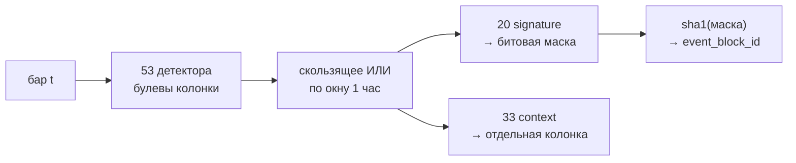

# Глава 6. События: атомы, битовые маски, блоки

> **Кратко.** Второй канал описания бара — дискретный. 53 булевых детектора
> («атома») в 13 семействах; 20 из них — «происшествия» (signature), остальные
> 33 — «фон» (context). Signature-атомы, активные в часовом окне вокруг бара,
> кодируются битовой маской, хэш которой даёт `event_block_id`. Контекстные не
> входят в маску никогда — иначе комбинаторный взрыв уничтожил бы возможность
> набрать историческую выборку. Глава объясняет это разделение, даёт все
> детекторы и разбирает, почему порядок битов нельзя менять.

---

## 6.1. Зачем второй канал

Признаки (глава 5) описывают бар непрерывными величинами: «RSI 0.72», «ранг
волатильности 0.15». Этого достаточно, чтобы определить состояние рынка, но
недостаточно, чтобы описать **происшествия**.

Разница содержательная. «Волатильность высокая» — это состояние, оно длится.
«Цена пробила максимум прошлой недели» — это событие, оно случается в конкретный
момент и после него мир другой. Первое естественно описывается числом, второе —
флагом.

Практическая роль событий в системе — **уточнение ключа выборки**. Кандидат
отвечает на вопрос «что бывало раньше при такой конфигурации», и конфигурация
задаётся парой:

$$\text{ключ} = (\text{transition\_id},\ \text{event\_block\_id})$$

то есть «переход 4→1, сопровождённый вот таким набором происшествий». Без
второй половины ключ был бы грубее: все переходы 4→1 сваливались бы в одну
корзину независимо от того, случился ли при этом пробой недельного максимума.

---

## 6.2. Атом, семейство, блок

**Атом** — булев детектор, одна колонка на бар. Например,
`breakout_1d_high` = «закрытие выше максимума предыдущих суток».

**Семейство** — смысловая группировка атомов. Их 13:
`price_action_events`, `volatility_events`, `volume_events`, `trend_events`,
`momentum_events`, `zone_context_events`, `session_events`,
`structure_events`, `imbalance_events`, `liquidity_events`, `zone_events`,
`sentiment_events`, `derivative_events`.

**Блок событий** — набор signature-атомов, активных в окне вокруг бара,
свёрнутый в идентификатор.



---

## 6.3. Двадцать signature-атомов

Это «происшествия»: пробои, всплески, кроссы, развороты. Они входят в маску.

### Семейство price_action_events (6)

| Атом | Условие |
|---|---|
| `breakout_1d_high` | $C_t > \max_{i \in w_{1d}} H_{i}$, окно сдвинуто на бар |
| `breakdown_1d_low` | $C_t < \min_{i \in w_{1d}} L_{i}$ |
| `breakout_1w_high` | то же на недельном окне |
| `breakdown_1w_low` | то же |
| `wide_range_bar` | $H_t - L_t > 2 \cdot \overline{(H-L)}_{w_{1d}}$ |
| `inside_bar` | $H_t \le H_{t-1}$ и $L_t \ge L_{t-1}$ |

`shift(1)` в экстремумах обязателен: пробой сравнивается с диапазоном **до**
текущего бара, иначе условие «выше своего же максимума» выполнялось бы всегда.

### Семейство volatility_events (3)

| Атом | Условие |
|---|---|
| `vol_expansion` | $\text{rv}_d > 1.5 \cdot \text{rv}_w$ |
| `vol_contraction` | $\text{rv}_d < 0.6 \cdot \text{rv}_w$ |
| `atr_spike` | $H_t - L_t > 3 \cdot \text{ATR}_{14}$ |

### Семейство volume_events (2 signature из 4)

| Атом | Условие |
|---|---|
| `volume_spike` | $V_t > 3 \cdot \overline{V}_{w_{1d}}$ |
| `volume_dry` | $V_t < 0.3 \cdot \overline{V}_{w_{1d}}$ |

Два оставшихся атома семейства (`taker_buy_dominance`, `taker_sell_dominance`) —
контекстные.

### Семейство trend_events (2 signature из 4)

| Атом | Условие |
|---|---|
| `ema_cross_up` | $(C_t - \text{EMA}_{w_{1d}}) > 0$ и предыдущее $\le 0$ |
| `ema_cross_down` | зеркально |

`trend_up_align` и `trend_down_align` — контекстные: они описывают не момент, а
длящееся положение.

### Семейство momentum_events (4)

| Атом | Условие |
|---|---|
| `rsi_overbought` | $\text{RSI}_{14} > 70$ |
| `rsi_oversold` | $\text{RSI}_{14} < 30$ |
| `momentum_reversal_up` | RSI пересёк 30 снизу вверх |
| `momentum_reversal_down` | RSI пересёк 70 сверху вниз |

### Семейство zone_context_events (3 signature из 4)

| Атом | Условие |
|---|---|
| `at_range_high` | $\text{pos}(w_{1w}) > 0.85$ |
| `at_range_low` | $\text{pos}(w_{1w}) < 0.15$ |
| `round_level_touch` | цена у круглого уровня, см. ниже |

`mid_range` (позиция между 0.40 и 0.60) — контекстный.

### Круглые уровни: единственный порог, который был в долларах

Атом `round_level_touch` заслуживает отдельного разбора, потому что на нём видна
цена нарушения правила «ни один порог не в деньгах».

Исходная реализация: `close % 1000 < 50`. Для биткоина его основной эпохи это
работало и давало срабатывание примерно на 10% баров. Но:

- на SOL в диапазоне 100–200 долларов условие не выполняется **никогда**: атом
  мёртв, бит маски у монеты постоянно нулевой;
- на ETH срабатывал вырожденно — на широких полосах, а не на круглых уровнях.

То есть signature-атом, за который платили дроблением блоков, работал ровно на
одной монете из трёх.

Правильная формулировка масштабирует шаг по порядку величины цены:

$$\text{step}(C) = 10^{\lfloor \log_{10} C \rfloor - 1}$$

$$\text{round\_level\_touch} =
\left(C \bmod \text{step}\right) < 0.05 \cdot \text{step}
\ \lor\
\left(C \bmod \text{step}\right) > 0.95 \cdot \text{step}$$

BTC за 60 000 → шаг 1000, ETH за 3000 → 100, SOL за 150 → 10. Для биткоина его
основной эпохи это в точности прежний детектор; для остальных монет — его смысл,
а не его число.

Допуск 0.05 с каждой стороны даёт 10% баров — столько же, сколько давала прежняя
формула, поэтому гранулярность блоков от смены детектора не поехала.

Масштабная инвариантность проверяется тестом: тот же рынок, умноженный на
степень десяти, обязан дать ту же разметку.

---

## 6.4. Тридцать три контекстных атома

Контекст — это **фон**: то, что активно почти всегда и описывает не
происшествие, а обстановку.

### Базовые (9)

| Атом | Условие |
|---|---|
| `trend_up_align` | $C > \text{EMA}_{1d} > \text{EMA}_{1w}$ |
| `trend_down_align` | $C < \text{EMA}_{1d} < \text{EMA}_{1w}$ |
| `mid_range` | $0.40 \le \text{pos}(w_{1w}) \le 0.60$ |
| `taker_buy_dominance` | сглаженная доля покупок тейкеров > 0.60 |
| `taker_sell_dominance` | < 0.40 |
| `asia_session` | час UTC в [0, 8) |
| `europe_session` | [8, 14) |
| `us_session` | [14, 22) |
| `weekend` | день недели ≥ 5 |

> **Известный дефект, не исправленный намеренно.** Сессии покрывают 00:00–22:00
> UTC; два часа в сутках (22:00–24:00) не принадлежат ни одной. Это не
> «межсессионное окно» по замыслу — граница досталась от первой версии и с тех
> пор не пересматривалась (азиатскую сессию обычно берут с 23:00 UTC). Трогать
> молча нельзя: атомы посчитаны на всей истории, и сдвиг границы требует
> `scripts/backfill_context_atoms.py --force --all`, иначе одна и та же величина
> будет означать разное до и после правки. Решение за владельцем.
>
> Именно из-за этого дефекта сезонность в замерах размаха (глава 13) выражается
> **циклическими гармониками часа**, а не сессионными атомами: гармоники от
> дефекта свободны и не имеют разрывов на границах.

### Smart Money (16)

Четыре семейства: `structure_events` (BOS, CHoCH, направление структуры),
`imbalance_events` (FVG), `liquidity_events` (снятия ликвидности и возвраты),
`zone_events` (ордер-блоки, брейкеры, премия/скидка).

Все шестнадцать — контекстные, и это сознательный порядок: сначала завести
детекторы фоном и измерить лифт бесплатно, и только потом двигать выживших в
signature, платя дроблением блоков. Не выжил ни один (глава 18).

### Fear & Greed (4)

`fear_extreme` (индекс < 25), `greed_extreme` (> 75), `sentiment_flip_up`,
`sentiment_flip_down` (пересечение середины шкалы).

Контекстные по природе источника: индекс общерыночный, один ряд на все монеты, и
происшествием конкретного бара он не является.

### Деривативы (4)

Квадранты `oi_vs_price`: `oi_up_price_up`, `oi_up_price_down`,
`oi_down_price_up`, `oi_down_price_down` — знак часового изменения открытого
интереса против знака часовой доходности.

Величина с тремя значениями ($\operatorname{sign} \times \operatorname{sign}$) в
вектор признаков не годится вовсе: IQR вырождается на трёхзначном входе.
Поэтому — квадранты как атомы.

### Колонки существуют всегда

Атомы источников заводятся как колонки **независимо от флага**: при выключенном
источнике они просто всегда `False`.

```python
for source in registry.sources():
    columns = [c for c in source.atom_columns if c in ATOM_FAMILY]
    if not source.atoms_enabled():
        for name in columns:
            a[name] = False
        continue
    values = source.compute(base, symbol)
    for name in columns:
        a[name] = values[name]
```

Причина: `ATOMS` перечисляет их безусловно, и отсутствие колонки уронило бы срез
`a[ATOMS]`. Заодно набор имён не зависит от конфигурации — иначе `CONTEXT_ATOMS`
описывал бы то одно, то другое.

---

## 6.5. Почему контекст не входит в маску

Это инвариант 3 проекта, и он о комбинаторике.

Число возможных блоков растёт как $2^n$ по числу атомов в маске. При 20
signature-атомах теоретический потолок — миллион комбинаций, но реально
встречается около 4 400 (на истории BTC): большинство сочетаний невозможны или
крайне редки.

Добавьте 33 контекстных атома — и потолок станет $2^{53}$. Но проблема даже не в
потолке, а в **частоте активности**. Контекстные атомы активны почти всегда: в
каждый момент активна ровно одна сессия, почти всегда активен один из двух
трендовых атомов, часто — доминирование тейкеров. То есть каждый бар получал бы
почти уникальную комбинацию.

Последствие прямое: **историческая выборка по конкретному блоку не набирается
никогда.** Кандидат существует только потому, что в истории нашлось ≥30
независимых случаев с тем же ключом. Раздробите ключ — и случаев станет ноль.

Проверка после любых правок здесь:

```
runs.stats.candidates.scopes
```

Доля `transition+event_block` не должна быть близка к нулю. Живой пример
провала: у TAOUSDT при неудачных порогах кластеризации получилось 62 состояния,
998 рёбер и **ноль** кандидатов со scope `transition+event_block` — выборка
развалилась.

### Контекст при этом сохраняется

До 2026-08-09 контекстные атомы считались и молча выбрасывались. Из-за этого
лифт по фоновым признакам нельзя было измерить в принципе: сопоставлять кандидата
было не с чем.

Теперь они хранятся **отдельной колонкой** `bar_events.context_atoms`, а не
внутри `atoms`. Разделение принципиальное:

> `atoms`, `atom_count`, `families` и `primary_family` обязаны описывать ровно
> то, что закодировано в маске.

Иначе связка «блок ↔ его расшифровка» разъехалась бы. Регрессии:
`test_context_atoms_survive_to_the_output`,
`test_context_atoms_do_not_change_block_id`.

---

## 6.6. Битовая маска и её порядок

```python
ATOM_FAMILY: dict[str, str] = { ... }          # порядок задаёт номера битов
ATOMS = list(ATOM_FAMILY)
SIGNATURE_ATOMS = [a for a in ATOMS if a not in CONTEXT_ATOMS]
ATOM_BIT = {atom: i for i, atom in enumerate(SIGNATURE_ATOMS)}
```

Маска строится векторно, сразу на все бары:

```python
bits = np.arange(len(SIGNATURE_ATOMS), dtype=np.int64)
masks = (active.to_numpy(dtype=np.int64) << bits).sum(axis=1)
```

$$\text{mask}(t) = \sum_{i=0}^{19} \mathbb{1}[\text{atom}_i \text{ активен}]
\cdot 2^i$$

Идентификатор блока — хэш маски, а не сама маска:

```python
def block_id(mask: int) -> str:
    digest = hashlib.sha1(str(int(mask)).encode()).hexdigest()
    return f"event_block_{int(digest[:8], 16) % 1_000_000:06d}"
```

Почему хэш: 20-битное число ничего не сообщает читателю, а формат
`event_block_NNNNNN` задан исходным ТЗ. Побочный эффект — теоретическая
возможность коллизии по модулю миллиона; при 4 400 реально встречающихся блоках
вероятность хотя бы одной коллизии по парадоксу дней рождения около 1%, и
последствия были бы мягкими (два разных блока считались бы одним). Это известный
компромисс.

### Правило порядка битов

> ⚠️ **Ломается молча.** Новые атомы добавляются **только в конец**
> `ATOM_FAMILY`. Вставка в середину сдвигает биты и меняет смысл всех
> исторических `event_block_id` — без единой ошибки: те же колонки, те же
> идентификаторы, правдоподобные значения. Первые 20 битов прибиты тестом
> `test_signature_bits_are_pinned`.

Порядок контекстных атомов тоже фиксирован и берётся из `ATOM_FAMILY`, а не из
множества `CONTEXT_ATOMS`: у множества порядок обхода между запусками не
гарантирован.

Заодно введена версия набора атомов (`bar_events.version`), собираемая из состава
источников по той же схеме, что версия признаков. Смысл блока задаёт не только
маска, но и то, какими детекторами она посчитана.

---

## 6.7. Окно агрегации

Атом активен не только на своём баре:

```python
rolled = detected.rolling(window_bars, min_periods=1).max().astype(bool)
```

Скользящее ИЛИ по окну в один час (4 бара при 15m). Событие часовой давности всё
ещё описывает контекст текущего бара — рынок не забывает пробой мгновенно.

Побочный эффект, о котором стоит помнить: блок бара $t$ и блок бара $t+1$ обычно
совпадают или почти совпадают. Это одна из причин зависимости наблюдений, с
которой борется блочный бутстрап (глава 12).

---

## 6.8. Производные характеристики блока

Из состава блока считаются четыре величины, все попадают в кандидата.

**Интенсивность** — по числу активных атомов:

$$\text{intensity} = \begin{cases}
\text{sparse}, & n \le 2 \\
\text{moderate}, & 3 \le n \le 5 \\
\text{dense}, & n \ge 6
\end{cases}$$

**Основное семейство** — то, из которого в блоке больше всего атомов:

```python
counts = Counter(ATOM_FAMILY[n] for n in names)
primary = max(counts, key=counts.get)
```

**Редкость блока** — по доле баров, на которых он встречался:

$$\text{rarity} = \begin{cases}
\text{rare}, & \text{share} < 0.002 \\
\text{uncommon}, & 0.002 \le \text{share} < 0.01 \\
\text{common}, & \text{иначе}
\end{cases}$$

Здесь пороги **абсолютные**, в отличие от редкости переходов (глава 3), где они
перцентильные. Разница осмысленна: число блоков не зависит от числа состояний,
поэтому доля 0.2% означает одно и то же на любом графе.

**Доля строк** — `row_share`, та самая доля, по которой считается редкость.

### Оптимизация расшифровки

Уникальных масок на порядки меньше, чем баров (4 400 против 315 000), поэтому
расшифровка идёт по одному разу на маску:

```python
unique = pd.unique(masks)
meta = {int(mask): {...} for mask in unique}
for field in ("event_block_id", "atoms", "families", ...):
    out[field] = out["mask"].map(lambda m: meta[int(m)][field])
```

То же для контекстных масок: словарь строится по **фактически встреченным**
комбинациям, поэтому его размер ограничен данными, а не разрядностью $2^{33}$.

---

## 6.9. Два канала: правило, которое всё объясняет

Признак и атом — **разные каналы**, и их нельзя путать. Это, пожалуй, самое
частое недоразумение при работе с системой.

| | Признак | Атом |
|---|---|---|
| Тип | непрерывный | булев |
| Входит в вектор кластеризации | да | нет |
| Влияет на `group_id` | да | нет |
| Входит в `event_block_id` | нет | только signature |
| Попадает в имя состояния | да | никогда |
| Цена заведения | полный `train` | ноль (для контекстных) |
| Где хранится | `features.values[]` | `bar_events.atoms[]` / `.context_atoms[]` |

Отсюда ответ на вопрос «почему X не видно в графе»: почти всегда дело в том,
каким из двух каналов X заведён.

Имя состояния считается из `top_features`, то есть из вектора **признаков**.
Атомы — включая все 33 контекстных — в вектор не входят и в имя попасть не могут
ни при каких настройках словаря.

Чем состояние выделяется по **фону**, показывает отдельный механизм: агрегат
`state_context`, считающийся из `bar_events.context_atoms` в конце `train`. Для
каждого состояния — доля баров, на которых атом активен, и лифт относительно
всей истории:

$$\text{lift}(a, g) =
\frac{P(a \mid \text{состояние } g)}{P(a)}$$

Он работает на действующей модели, без переобучения, и это ровно та бесплатность,
ради которой контекстные атомы и заведены.

---

## 6.10. Резюме главы

53 детектора, из которых 20 формируют идентификатор блока, а 33 остаются фоном.
Разделение продиктовано комбинаторикой: фон активен почти всегда, и его
включение в ключ уничтожило бы возможность набрать историческую выборку.

Три правила, нарушение каждого из которых даёт тихую порчу данных:

1. новые атомы — только в конец `ATOM_FAMILY`;
2. контекстные атомы не входят в маску и хранятся отдельной колонкой;
3. каждый атом обязан иметь русскую подпись в `naming.ATOM_LABELS`, иначе он
   уходит в интерфейс сырым идентификатором.

Все три закрыты тестами.

Следующая глава — центральная: как 315 тысяч точек в 32-мерном пространстве
превращаются в несколько десятков состояний.
