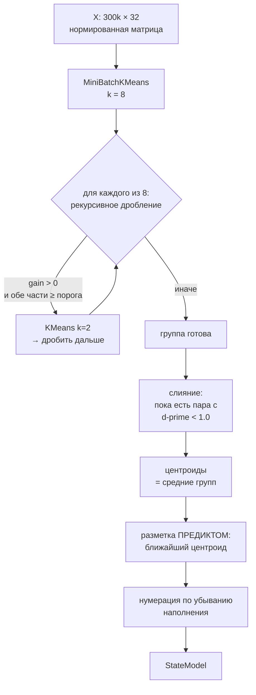

# Глава 7. Состояния: адаптивная кластеризация

> **Кратко.** Число состояний не задаётся, а вырастает из данных: грубое
> стартовое разбиение на 8 кластеров, затем рекурсивное дробление по
> gap-статистике Тибширани с порогом в сигмах референса, затем слияние
> неразличимых пар по d-prime. Модель — это только центроиды; состояние точки
> определяется как ближайший центроид, и никак иначе. Глава разбирает каждый
> шаг, объясняет две поправки, за которые пришлось заплатить отдельными
> замерами, и честно описывает то, что не удалось починить: число состояний
> невоспроизводимо.

---

## 7.1. Постановка

На входе — матрица $X \in \mathbb{R}^{N \times d}$, где $N \approx 300\,000$
(бары), $d = 32$ (признаки), уже нормированная robust-масштабированием (глава
5.6).

На выходе нужна модель, умеющая по любой точке — в том числе новой, которой не
было при обучении, — назвать номер состояния. И нужно, чтобы:

- число состояний определялось данными, а не задавалось руками (требование ТЗ);
- каждое состояние было достаточно большим, чтобы по нему набиралась
  историческая статистика;
- состояния были содержательно различимы, а не разрезаны произвольно.

Три требования конфликтуют: первое толкает к дроблению, второе и третье — к
укрупнению. Алгоритм — это способ их примирить.

---

## 7.2. Общая схема



Три фазы: **дробление сверху вниз**, **слияние снизу вверх**, **фиксация
центроидов**.

---

## 7.3. Фаза 0: стартовое разбиение

```python
seed_labels = MiniBatchKMeans(
    n_clusters=8, n_init=5, random_state=42, batch_size=4096
).fit_predict(x)
```

Восемь крупных облаков — просто чтобы рекурсия стартовала не с одного корня.
MiniBatch, а не полный KMeans: на 300 тысячах точек разница во времени
существенна, а точность стартового разбиения не важна — его всё равно будут
дробить.

Именно здесь, впрочем, живёт основной источник невоспроизводимости (раздел 7.9).

---

## 7.4. Фаза 1: дробление и gap-статистика

### Вопрос, на который отвечает критерий

Дана группа точек. Разбить ли её надвое?

Наивный ответ — «посчитать силуэт разбиения и сравнить с порогом» — неверен, и
причина фундаментальная: **KMeans всегда что-нибудь находит.** Разбейте надвое
однородный шар из равномерных точек — получите два кластера с положительным
силуэтом. Силуэт сам по себе не отвечает на вопрос «есть ли здесь структура».

### Силуэт

Для точки $i$ в кластере $A$:

$$s(i) = \frac{b(i) - a(i)}{\max(a(i), b(i))}$$

где $a(i)$ — среднее расстояние до точек своего кластера, $b(i)$ — среднее
расстояние до точек ближайшего чужого. Силуэт разбиения — среднее по всем
точкам, значение в $[-1, 1]$.

### Gap statistic

Идея Тибширани (2001): сравнивать не с абсолютным порогом, а **с тем же
разбиением случайного облака той же формы**.

Референс генерируется равномерно в bounding box исходной выборки:

```python
low, high = sample.min(axis=0), sample.max(axis=0)
reference = rng.uniform(low, high, size=sample.shape)
```

и разбивается тем же KMeans на 2 кластера. Если реальные данные структурированы,
их силуэт будет заметно выше силуэта референса; если это просто облако — разница
уйдёт в шум.

Формула критерия в реализации проекта:

$$\text{gain} = s_{\text{real}} - \overline{s_{\text{ref}}} -
k \cdot \sigma_{\text{ref}} \cdot \sqrt{1 + \frac{1}{B}}$$

где $B = 10$ — число референсов, $k = 2.0$ — порог в сигмах,
$\sigma_{\text{ref}}$ — выборочное стандартное отклонение силуэтов референсов.

Порог **уже взят внутрь величины**, поэтому решение о дроблении — это просто
`gain > 0`.

Поправка $\sqrt{1 + 1/B}$ — стандартная у Тибширани: сигма референса сама
оценена по $B$ наблюдениям, и её собственная неопределённость входит в порог.

### Почему не абсолютный порог

До 2026-08-11 критерий выглядел как $s_{\text{real}} - s_{\text{ref}} > 0.02$ с
**одним** референсом. Это было неверно дважды.

**Один референс — это один draw случайной величины.** Силуэт случайного облака
сам случаен, со своей дисперсией. Сравнение с одним draw при пороге 0.02
означало, что решения вблизи границы определяет шум конкретной генерации.
Генератор был засеян, поэтому на идентичных данных всё воспроизводилось, — но
лишняя неделя баров меняла подвыборку, меняла draw, и решения переворачивались.
Отсюда наблюдавшийся разброс числа состояний у ETH: 29 → 26 → 42 на трёх
прогонах.

**Абсолютный порог зависит от размерности.** В высокой размерности работает
концентрация расстояний: отношение разброса расстояний к их среднему падает как
$O(1/\sqrt{d})$, и все точки становятся «примерно одинаково далеко» друг от
друга. Силуэты сжимаются — и реальный, и референсный, но **неодинаково**.
Константа 0.02, подобранная на 32 измерениях, в 44 измерениях означает другую
строгость.

Практическое последствие было тяжёлым: добавление двенадцати признаков **любой
природы** обрушивало граф. У BTC 43 состояния → 31 с признаками SMC и → **22 с
чистым шумом той же формы**. То есть свойство калибровки выдавалось за свойство
источника данных, и каждый новый источник менял гранулярность графа сам по себе.

Порог в сигмах самонормируется: сигма меряется в тех же единицах, в которых
сжался силуэт. Ради этого свойства gap statistic и придуман.

Регрессия — `test_split_gain_is_independent_of_dimensionality`.

### Стоимость

$B$ прогонов KMeans по референсу вместо одного. Смягчено тем, что референсам
хватает `n_init=1`: облако однородно, множественные старты ему ничего не дают
(реальное разбиение внутри критерия считается с `n_init=3`, а фактическое
разбиение группы после решения — с `n_init=5`). Итого дробление подорожало
втрое, а не вдесятеро.

Плюс силуэт считается не на всей группе, а на подвыборке в 4000 точек
(`STATES_SILHOUETTE_SAMPLE`): силуэт имеет квадратичную сложность по числу
точек, и на 300 тысячах он не считается вовсе.

### Рекурсия и её ограничители

```python
def _recursive_split(x, indices, depth, ...):
    if depth >= max_depth or size < 2 * min_group_size:
        out.append(indices); return

    gain = _split_gain(x[indices], rng, cfg)
    if gain <= 0.0:
        out.append(indices); return

    labels = KMeans(n_clusters=2, n_init=5).fit_predict(x[indices])
    left, right = indices[labels == 0], indices[labels == 1]
    if min(len(left), len(right)) < min_group_size:
        out.append(indices); return          # разбиение оставляет огрызок

    _recursive_split(x, left,  depth + 1, ...)
    _recursive_split(x, right, depth + 1, ...)
```

Три ограничителя: глубина (`max_depth = 4`, то есть до 16 групп на ветку),
минимальный размер группы и запрет на разбиение, оставляющее огрызок.

Каждое решение пишется в `trace`, последние 200 записей сохраняются в
`state_models.params` — по ним можно постфактум разобрать, где дробление
остановилось и почему.

### Относительный порог размера группы

$$\text{min\_group\_size}_{\text{эфф}} =
\max\left(300,\ \operatorname{round}(0.0025 \cdot N)\right)$$

Здесь $N$ — **число строк матрицы признаков**, а не баров: первые примерно
четыре недели истории уходят на прогрев окон (глава 5.4), и в кластеризацию они
не попадают. Разница невелика (у BTC 312 758 строк против 315 422 баров), но
именно строки определяют порог, и именно они сохраняются в
`state_models.params.n_samples`.

Два числа, и роли у них разные.

**Доля — основной механизм.** 800 баров это 0.27% истории BTC с 2017 года и 1.1%
истории двухлетней монеты. С общим абсолютным порогом дробление на короткой
истории останавливается рано, и граф выходит грубее не потому, что рынок
однороднее, а потому что линейка чужая.

**Абсолютное число — пол, а не значение по умолчанию.** Группа в сотню баров не
даёт кандидату статистики при любой длине истории.

> ⚠️ **Ломается молча.** Раньше пол был равен 800 — и перекрывал долю на всём
> диапазоне реальных историй ($0.0025 \times 320\,000 = 800$), то есть
> относительный порог был чистой формальностью. Регрессия —
> `test_absolute_floor_does_not_swallow_the_share`.

Живые эффективные пороги — из `state_models.params` боевых моделей:

| Монета | Прогон | $N$ строк | $0.0025 N$ | Эффективный | Что сработало |
|---|---|---|---|---|---|
| BTCUSDT | #24 | 312 758 | 782 | **782** | доля |
| ETHUSDT | #25 | 312 591 | 781 | **781** | доля |
| SOLUSDT | #26 | 208 556 | 521 | **521** | доля |
| AAVEUSDT | #38 | 203 071 | 508 | **508** | доля |
| TAOUSDT | #43 | 80 873 | 202 | **550** | переопределение реестра |
| HYPEUSDT | #34 | 36 741 | 92 | **300** | абсолютный пол |

Две нижние строки — ровно те случаи, ради которых порог устроен из двух чисел.

**HYPEUSDT показывает работу пола.** Доля дала бы 92 бара на группу — по такой
выборке кандидат не наберётся никогда, поэтому включается абсолютный минимум.

**TAOUSDT — единственная монета с `states_overrides`**, и это первый случай,
когда порог пришлось **поднять**, а не опустить. Относительный дал 202, монета
упёрлась в пол 300 — вдвое ниже эффективных порогов SOLUSDT и AAVEUSDT, у
которых истории втрое больше. Граф на полу дробился до 62 состояний и разваливал
выборку: 998 рёбер, 2360 кандидатов и **ноль** со scope
`transition+event_block`. С порогом 550 получилось 44 состояния и работающая
выборка.

---

## 7.5. Фаза 2: слияние и d-prime

После дробления групп много, и часть из них различима только формально: границы
между ними прошли там, где облако однородно.

### Мера различимости

Наивная мера — «центроиды ближе суммы радиусов групп» — в высокой размерности не
работает, и это тоже эффект концентрации. Радиус группы (среднее расстояние
точек до центроида) растёт как $\sqrt{d}$: в 32 измерениях каждая координата
вносит свой вклад в норму, и облако, компактное покоординатно, «на глаз метрики»
огромно. Критерий по радиусу схлопывал граф до 3–4 состояний вместо 43.

Правильная мера смотрит **только вдоль оси между центроидами**:

$$\hat{u} = \frac{c_B - c_A}{\|c_B - c_A\|}$$

$$d' = \frac{\|c_B - c_A\|}{\sigma_A^{\parallel} + \sigma_B^{\parallel}},
\qquad
\sigma_G^{\parallel} = \operatorname{std}\left(
\{\langle x_i, \hat{u}\rangle : i \in G\}\right)$$

Это классический **d-prime** из теории обнаружения сигнала: расстояние между
двумя распределениями, выраженное в их собственном разбросе по той же оси.
Проекция одномерна, поэтому от размерности пространства величина не зависит
вовсе.

Порог: $d' < 1.0$ означает «облака перекрываются настолько, что говорить о двух
состояниях нет смысла».

```python
axis = c_right - c_left
distance = np.linalg.norm(axis)
axis = axis / distance
std_left  = np.std(x[left]  @ axis)
std_right = np.std(x[right] @ axis)
return distance / (std_left + std_right)
```

### Жадное слияние

На каждом шаге сливается **самая неразличимая** пара, пока есть пары ниже
порога. Так схлопываются и цепочки почти одинаковых состояний.

Реализация оптимизирована: матрица $d'$ считается один раз, после слияния
пересчитываются только пары с участием новой группы — $O(k)$ вместо $O(k^2)$ на
итерацию.

Стоило это оптимизировать: раньше каждая итерация обходила все пары, а
`_separation` каждый раз заново усредняла сотни тысяч точек. На 50 группах один
проход стоил около 3 секунд, и таких проходов было столько же, сколько слияний.
Результат тождественный — правило выбора («самая неразличимая пара ниже порога»)
не изменилось.

---

## 7.6. Фаза 3: центроиды и разметка предиктом

Центроид группы — среднее её точек:

$$c_g = \frac{1}{|G|}\sum_{i \in G} x_i$$

**Модель — это только центроиды.** Плюс имена признаков и параметры нормировки:

```python
@dataclass
class StateModel:
    feature_names: list[str]
    scale: dict[str, np.ndarray]      # median, iqr
    centroids: np.ndarray             # (n_groups, n_features)
    group_ids: np.ndarray
    params: dict
```

### Правило, которое пришлось чинить: predict, а не членство

Здесь произошла одна из самых поучительных ошибок проекта.

Естественно казалось, что состояние бара — это группа, в которую он попал при
дроблении. Так `train` и писал. А `live` размечал свежие бары единственным
доступным ему способом — **ближайшим центроидом**, потому что модель хранит
только центроиды.

Это два разных правила. Дробление режет пространство последовательными
локальными границами; итоговая ячейка группы **не совпадает** с ячейкой её
центроида (слияния усугубляют эффект, но не создают его). Модель воспроизвести
членство не способна в принципе.

> ⚠️ **Ломалось молча.** Замер на боевых моделях всех четырёх монет:
> расхождение **21–28% баров**. У SOL предикт находил на 16% больше переходов.
> `market_groups` и имена состояний описывали разбиение, которого боевой
> предиктор не давал на четверти истории.

Починка: единственное определение состояния — «ближайший центроид», и `train`
теперь размечает историю тем же предиктом:

```python
provisional = StateModel(centroids=centroids, group_ids=np.arange(len(groups)))
assignment = provisional.nearest(x)
```

Регрессия — `test_fit_labels_equal_predict`: `fit_states(...)[1]` обязано
тождественно совпадать с `model.predict(x)`.

Побочный эффект: некоторые центроиды после этого оказываются **пустыми** — их
ячейка не содержит ни одной точки. Такие отбрасываются: строка в `market_groups`
без баров не нужна, а разметку это не меняет.

### Вычислительный трюк в predict

Расстояние считается через разложение квадрата нормы:

$$\|x - c\|^2 = \|x\|^2 - 2\langle x, c\rangle + \|c\|^2$$

```python
d2 = (x*x).sum(axis=1)[:, None] - 2.0 * (x @ c.T) + (c*c).sum(axis=1)[None, :]
return d2.argmin(axis=1)
```

Наивная форма (`np.linalg.norm(x[:, None] - c, axis=2)`) материализует массив
$(N, k, d)$ — на боевой размерности BTC (300 тыс. × 32 × 45) это **7 ГБ пика и 5
секунд** против 0.2 ГБ и 0.24 секунды здесь.

Это не только про скорость. `predict` зовётся на полной истории в каждом `live`
(раз в полчаса на монету), в `train`, в replay и в holdout; семь гигабайт рядом с
PostgreSQL и Neo4j на 8-гигабайтном VPS — это своп.

Метки совпадают тождественно: `argmin` инвариантен к монотонным преобразованиям,
поэтому квадрат расстояния годится не хуже расстояния, а $\|x\|^2$ — общий сдвиг
по строке — на `argmin` не влияет вовсе (оставлен ради читаемости формулы).

### Нумерация

```python
counts = np.bincount(assignment, minlength=len(groups))
order = np.argsort(-counts, kind="stable")
order = order[counts[order] > 0]
group_ids = np.arange(1, len(order) + 1, dtype=float)
```

Крупные группы получают меньшие номера: состояние 1 — самое частое состояние
рынка. Удобно читать в графе; ценой того, что номера несопоставимы между
прогонами.

Наполнение считается **по предикту**, а не по членству в группах дробления —
после починки это одно и то же, но раньше было двумя разными вещами.

---

## 7.7. Результат на живых данных

| Монета | Прогон | $N$ строк | Состояний | Рёбер | Кандидатов |
|---|---|---|---|---|---|
| BTCUSDT | #24 | 312 758 | 51 | 760 | 37 497 |
| ETHUSDT | #25 | 312 591 | 35 | 471 | 41 853 |
| SOLUSDT | #26 | 208 556 | 55 | 851 | 20 905 |
| AAVEUSDT | #38 | 203 071 | 24 | 304 | 20 557 |
| HYPEUSDT | #34 | 36 741 | 42 | 476 | 1 785 |
| TAOUSDT | #43 | 80 873 | 44 | 629 | 4 008 |

Разброс 24–55 состояний. Обратите внимание на AAVEUSDT: 24 состояния при 203
тысячах строк — вдвое меньше, чем у SOLUSDT на сопоставимой истории. Это **не**
порог размера: минимальная группа получилась 572 при эффективном пороге 508,
дробление остановил gap-критерий. Доля `transition+event_block` при этом
здоровая (15.6%), поэтому переопределения намеренно не заданы.

И обратите внимание на HYPEUSDT: 42 состояния на 37 тысячах строк, то есть граф
у самой молодой монеты не грубее, чем у BTC. Число состояний с длиной истории
**не коррелирует** — и следующий раздел объясняет, почему на него вообще нельзя
опираться.

---

## 7.8. Полный список параметров

| Параметр | Значение | Смысл |
|---|---|---|
| `STATES_SEED_CLUSTERS` | 8 | стартовое разбиение |
| `STATES_MIN_GROUP_SHARE` | 0.0025 | доля истории — основной порог размера |
| `STATES_MIN_GROUP_SIZE` | 300 | абсолютный пол |
| `STATES_MAX_DEPTH` | 4 | глубина рекурсии |
| `STATES_SPLIT_REFERENCE_DRAWS` | 10 | число референсов $B$ |
| `STATES_SPLIT_GAIN_SIGMA` | 2.0 | порог в сигмах $k$ |
| `STATES_MERGE_SEPARATION` | 1.0 | порог d-prime |
| `STATES_SMOOTHING_BARS` | 2 | подтверждение смены состояния (глава 8) |
| `STATES_TRAJECTORY_WINDOW` | 24 | окно энтропии траектории (глава 8) |
| `STATES_SILHOUETTE_SAMPLE` | 4000 | подвыборка для силуэта |
| `random_state` | 42 | зерно |

### Честно о том, как выбрано 2.0

Свип по $k \in \{0.5, 0.75, 1.0, 1.5, 2.0\}$ × три окна × три монеты был сделан
(`scripts/calibrate_split_gain.py`). Но его критерий — разброс числа состояний
между окнами — оказался негодной мерой, потому что процедура меняет ответ на 15%
уже от пятидесяти баров. То есть «10.3% разброса при 2.0» против «31.6% при 1.0»
— две реализации одного шума, а не свойство порога.

Поэтому 2.0 стоит по слабому основанию: при нём число состояний попадает в
разумный диапазон на всех монетах и стоимость дробления умеренная. Это выбор по
здравому смыслу, а не по замеру, и он честно так и записан в комментарии к
параметру.

Что от порога **не** зависит и починено по-настоящему: критерий больше не
определяется одним случайным референсом и не зависит от размерности.

---

## 7.9. Чего починить не удалось: воспроизводимость

Замер 2026-08-11: **отбрасывание пятидесяти баров** (0.016% истории BTC) меняет
число состояний с 40 на 46.

Разбор причины. Сам gap-критерий вдали от границы воспроизводим уверенно: на
крупных группах BTC по восьми разным подвыборкам силуэта он даёт
$+0.032 \pm 0.007$ (решение «дробить» 8 раз из 8) и $-0.019 \pm 0.010$ (1 из 8).
Но **у границы он переворачивается**, а дальше рекурсия усиливает единственный
перевёрнутый выбор во всё поддерево: одно решение «дробить» вместо «не дробить»
на глубине 1 меняет до 8 листьев.

Плюс стартовое разбиение MiniBatchKMeans само чувствительно к малым изменениям
данных.

**Хаос живёт в процедуре, а не в пороге.** Порогом это не лечится.

Это видно прямо в базе — все сохранённые модели по монетам, при неизменных
параметрах кластеризации:

| Монета | Моделей | Число состояний по прогонам |
|---|---|---|
| BTCUSDT | 3 | 51, 46, 43 |
| ETHUSDT | 3 | 35, 44, 47 |
| SOLUSDT | 3 | 55, 63, 57 |
| TAOUSDT | 4 | 62, 37, 37, 44 |

У ETH разброс 35–47 на трёх прогонах одной и той же монеты. У TAO первый прогон
(62) шёл с другим порогом, но 37 → 37 → 44 — уже при одинаковой конфигурации:
две модели совпали, третья разошлась на семь состояний.

Практические следствия, которые надо помнить всегда:

1. **число состояний — характеристика прогона, а не рынка монеты.** Сравнивать
   графы двух прогонов по числу узлов бессмысленно;
2. «стало больше состояний» — **не диагноз** и не повод чинить;
3. любой замер, чья выборка порождается моделью (например, лифт по атомам на
   выборке кандидатов), **не переживает пересборку модели**. Именно на этом
   сгорели первые результаты по SMC: `structure_bullish` проходил 2 монеты из 3
   на прежних моделях и 1 из 3 на новых;
4. поэтому же валидация системы (глава 12) требует повторения вывода **на двух
   разных моделях состояний** — иначе она мерила бы реализацию процедуры.

Направление починки (не сделано): либо ансамблирование по нескольким зёрнам с
голосованием, либо переход к процедуре без рекурсии, либо явная стабилизация
через сопоставление центроидов соседних прогонов.

---

## 7.10. Почему именно KMeans

Короткое обоснование, потому что вопрос возникает первым.

**Почему не DBSCAN / HDBSCAN.** Плотностные методы в 32 измерениях страдают от
той же концентрации расстояний: понятие «плотность» размывается, и почти всё
попадает либо в один кластер, либо в шум. Плюс DBSCAN не даёт центроидов — а
модель обязана уметь разметить новую точку, не имея под рукой всей истории.

**Почему не гауссова смесь (GMM).** Она даёт мягкое распределение по кластерам и
центры — казалось бы, подходит. Но GMM оценивает ковариационные матрицы; в 32
измерениях полная матрица — 528 параметров на компоненту, и на 40 компонентах
это переобучение. Диагональная матрица снимает проблему, но тогда GMM
вырождается в взвешенный KMeans, и выгоды не остаётся.

**Почему не иерархическая кластеризация.** Классическая агломеративная требует
матрицу попарных расстояний — $300\,000^2$ элементов, то есть 700 ГБ. Ward с
приближениями возможен, но рекурсивное дробление KMeans — это, по сути, та же
иерархия, только сверху вниз и без матрицы.

**Почему не спектральная.** Та же проблема матрицы сходства, плюс отсутствие
модели для новых точек.

KMeans выбран потому, что он даёт ровно то, что нужно, — набор центроидов, —
и масштабируется на сотни тысяч точек. Его известная слабость (сферические
кластеры равного размера) частично компенсирована рекурсией: дробление позволяет
описать несферическое облако несколькими сферами.

---

## 7.11. Резюме главы

Алгоритм состоит из двух противонаправленных механизмов: дробление ищет
структуру, слияние убирает избыточность. Оба нормированы так, чтобы не зависеть
от размерности пространства — gap-статистика через сигмы референса, различимость
через проекцию на ось.

Модель — только центроиды, состояние — ближайший центроид, и это единственное
определение: два правила разметки давали расхождение на четверти баров.

Главное неустранённое свойство: число состояний невоспроизводимо при малых
изменениях данных. Это ограничивает всё, что на нём строится, и объясняет,
почему валидация системы требует двух моделей.

Следующая глава — что делается с полученными метками: сглаживание, возраст,
энтропия, переходы и автоматические имена состояний.
