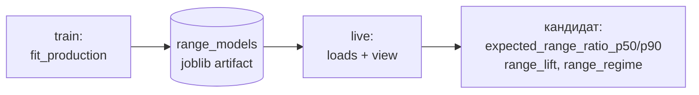

# Глава 13. Размах: единственная работающая конструкция

> **Кратко.** После того как направление было закрыто дважды, тот же аппарат
> перенаправили на вопрос «насколько широко сходит цена». Здесь картина
> обратная: признаки дают измеримое приращение сверх тривиального бенчмарка,
> дискретизация в состояния его почти не сохраняет, а самый устойчивый предиктор
> в проекте — календарь. Построен квантильный регрессор, прошедший критерий из
> трёх условий на отложенной части. Это единственная конструкция проекта с
> положительным вердиктом.

---

## 13.1. Смена предмета

Направление закрыто двумя независимыми замерами (глава 1). Из этого не следует,
что признаки бесполезны — следует, что предмет предсказания выбран неудачно.

Размах — другая величина по природе. Направление близко к мартингалу: если бы
оно предсказывалось, это была бы прямая арбитражная возможность, которую рынок
устраняет. Волатильность же кластеризуется — это одно из самых устойчивых
эмпирических свойств финансовых рядов, известное с работ Мандельброта: за
крупными движениями следуют крупные, за спокойствием — спокойствие.

Плюс у волатильности есть **внутрисуточная сезонность**: азиатская сессия
спокойнее американской, выходные спокойнее будней. Это никакая не тайна и не
арбитраж — просто в разное время суток на рынке разное число участников.

Отсюда постановка задачи и главная ловушка одновременно: **предсказать размах
легко, предсказать его лучше календаря и недавней волатильности — трудно.**

---

## 13.2. Целевая величина

$$\text{range\_ratio}(t) = \frac{
\max_{i \in (t, t+H]} H_i - \min_{i \in (t, t+H]} L_i}
{\text{ATR}_{14}(t) \cdot \sqrt{H}}$$

Разобрана в главе 9.3. Три нормировки знаменателя:

| Нормировка | Знаменатель | Роль |
|---|---|---|
| `atr14` | $\text{ATR}_{14}$ | сравнима с разделами 36 и 47 журнала |
| `atr_h` | ATR по окну горизонта | числитель и знаменатель одной длины |
| `rv_h` | реализованная волатильность по окну горизонта, в цене | контроль: не разделяет конструкцию с range-предикторами |

Первые две входят в `NORMALIZATIONS` и используются по умолчанию: **любой вывод
засчитывается только при совпадении знака и порядка величины на обеих**.

Третья (`rv_h`) живёт отдельной константой `EXTRA_NORMALIZATIONS` и запрашивается
явно. Это не педантизм: три стенда берут `NORMALIZATIONS` как значение по
умолчанию, и добавленный элемент молча увеличил бы число их ячеек, а с ним и
поправку BH — при том что их критерии заявлены на двух нормировках. Сторож —
`test_extra_normalization_is_not_in_the_default_set`.

Моделируется **логарифм** цели:

```python
values = range_ratio.where(range_ratio > 0)
return np.log(values)
```

Неположительные значения (плоское окно на неликвидном участке ранней истории)
уходят в NaN, а не в $-\infty$: строка без размаха — это отсутствие наблюдения.

---

## 13.3. Стек бенчмарков

Три уровня, каждый включает предыдущий.

| Уровень | Состав | Прохождение сверх него означает |
|---|---|---|
| **B0** | константа (среднее обучающей части) | «хоть что-то» |
| **B1** | HAR-RV: $\ln \text{rv}$ на окнах 96 / 672 / 2880 баров | «сверх кластеризации волатильности» |
| **B2** | B1 + сезонность: sin/cos часа (гармоники 1 и 2) + флаг выходных | **основной бенчмарк** |

### HAR-RV

Heterogeneous Autoregressive model of Realized Volatility (Corsi, 2009) —
стандартная модель волатильности, эксплуатирующая её кластеризацию на нескольких
горизонтах сразу:

$$\ln \text{rv}_{t+1} = \beta_0 + \beta_d \ln \text{rv}^{(d)}_t
+ \beta_w \ln \text{rv}^{(w)}_t + \beta_m \ln \text{rv}^{(m)}_t + \varepsilon$$

Окна 96 / 672 / 2880 базовых баров — сутки, неделя, тридцать суток. (В признаках
месячное окно другое, 2688 баров = 28 суток; величины считаются в разных
модулях и совпадать не обязаны.)

Логарифм — по той же причине, что у цели: `rv` тяжелохвостая, и линейная модель
на сырой величине описывала бы несколько всплесков вместо ряда. HAR в исходной
форме и работает с логарифмами.

Оговорка о том, что именно взято у Corsi. В коде нет самой HAR-регрессии — есть
функция `har_columns`, отдающая три колонки $\ln \text{rv}$:

```python
for window in HAR_WINDOWS:                       # 96, 672, 2880
    rv = ind.realized_vol(close, window)
    columns[f"log_rv_{window}"] = np.log(rv.where(rv > 0))
```

Дальше их использует либо МНК (`ols_predictor`), либо бустинг
(`boosted_predictor`), и цель у них — не $\text{rv}_{t+1}$, а
$\ln(\text{range\_ratio})$. То есть от HAR заимствован **набор регрессоров**
(три горизонта памяти волатильности), а не модель целиком.

### Сезонность

$$\text{hour\_sin}_k = \sin\left(\frac{2\pi k h}{24}\right), \qquad
\text{hour\_cos}_k = \cos\left(\frac{2\pi k h}{24}\right),
\qquad k \in \{1, 2\}$$

плюс флаг выходных. Здесь $h$ — час с дробной частью (`index.hour +
index.minute / 60`).

Гармоника 1 — суточный цикл, гармоника 2 — полусуточный: рынок видит и смену
суток, и пару «американская сессия / азиатская сессия».

**Не сессионные атомы.** Они покрывают 00:00–22:00 UTC, и два часа в сутках не
принадлежат ни одной (глава 6.4). Циклический час свободен от этого дефекта и
вдобавок не имеет разрывов на границах.

### Почему B2 обязателен

> На горизонте 4h **час дня в одиночку объясняет вчетверо больше дисперсии, чем
> `rv`**. Всё, что коррелирует с часом — объёмы, поток тейкеров, открытый
> интерес, активность состояний, — получит сверх бенчмарка **без часа** ложное
> приращение.

Бенчмарк без сезонности в этой задаче бенчмарком не является. Именно на этом был
отозван гейт деривативов (глава 12.11).

B1 сохранён не для симметрии: разность $R^2(\text{B2}) - R^2(\text{B1})$ — это и
есть вклад сезонности, число, которое до этого не мерил никто, и оно само по
себе результат.

---

## 13.4. Что показал замер (раздел 47 журнала)

Стенд — `scripts/measure_range_horizons.py` (`make measure-range`), три
горизонта × две нормировки × шесть монет, purged walk-forward, блочный бутстрап,
поправка BH.

### Признаки предсказывают размах

32 признака дают **+0.03…+0.10** out-of-sample $R^2$ сверх B2 — на трёх монетах с
длинной историей, всех трёх горизонтах и обеих нормировках. Критерий был заявлен
до прогона и пройден.

Это первый содержательный положительный результат проекта.

### Разметка графа этого почти не сохраняет

На горизонте 4h `group_id` и `event_block_id` (через целевое кодирование внутри
фолда) дают **0–10%** от того же приращения.

Впервые сработала вторая строка таблицы главы 1: «есть сигнал в признаках, нет в
графе → потеря на дискретизации, узкое место — граф». Вывод главы 1 при этом
остаётся в силе: он про направление.

### Календарь сильнее всех внешних источников

Час дня двумя гармониками и день недели, **без единой рыночной величины**, дают
$R^2$ **0.055–0.187** на всех шести монетах.

Это больше, чем все три заведённых внешних источника вместе.

> Любой будущий продукт про размах обязан меряться относительно календаря —
> иначе он продаёт время суток под видом анализа рынка.

### Конфигурация как предиктор проиграла

Замер C3 (`make validate-range`) проверил ровно то, что делал бы продукт:
перцентиль `range_ratio` по конфигурации против бенчмарка B2 на отложенной
части.

**Конфигурация проиграла во всех 36 ячейках**: её Spearman +0.13…+0.29 против
+0.19…+0.50 у бенчмарка, парный тест не прошёл ни разу.

Причём перцентили конфигурации были откалиброваны прекрасно (ECE 0.011–0.069) —
и при этом бесполезны. Это тот случай, ради которого калибровка и точность
проверяются **порознь**.

Вывод, определивший конструкцию следующего раздела: если возвращаться к продукту
про размах, то через регрессор на признаках, а не через выборку по конфигурации.

---

## 13.5. Квантильный регрессор

`btcproc/analysis/range_forecast.py`.

### Вход

Матрица из двух частей, обе обязательны:

```python
def input_matrix(base, features):
    benchmark = pd.concat([rm.har_columns(base["close"]),
                           rm.seasonal_columns(base.index)], axis=1)
    frame = pd.concat([benchmark, features.reindex(base.index)], axis=1).dropna()
    return frame, list(benchmark.columns)
```

**B2 идёт в модель не для сравнения, а как её часть**: без него бустинг тратил бы
деревья на переоткрытие кластеризации волатильности и формы суток.

**32 признака целиком**, без дискретизации в состояния — в этом вся конструкция.

### Выход: четыре квантиля

```python
QUANTILES = (0.25, 0.50, 0.75, 0.90)
```

Квантили, а не среднее, по двум причинам.

**Распределение скошено вправо.** У BTC за 2024–2026: p25 = 0.79, p50 = 1.10,
p75 = 1.60, p90 = 2.28. Среднее в таком распределении не описывает ни один
типичный случай.

**Вопрос про хвост.** «Насколько широко может сходить цена» — это вопрос о
верхнем квантиле, а не о центре.

Четыре независимые головы `HistGradientBoostingRegressor(loss="quantile")`.
Функция потерь — пинбол:

$$L_\tau(y, \hat{y}) = \begin{cases}
\tau (y - \hat{y}), & y \ge \hat{y} \\
(\tau - 1)(y - \hat{y}), & y < \hat{y}
\end{cases}$$

```python
diff = actual - predicted
return float(np.mean(np.maximum(quantile * diff, (quantile - 1.0) * diff)))
```

Асимметричный штраф: при $\tau = 0.9$ занижение прогноза наказывается в девять
раз сильнее завышения, поэтому минимум достигается на 90-м перцентиле условного
распределения.

### Возврат в исходную шкалу

```python
out[f"p{int(q*100)}"] = np.exp(self.models[q].predict(x_full))
```

Экспонирование **точно**, без поправки: квантиль монотонного преобразования есть
преобразование квантиля,

$$Q_\tau(e^Z) = e^{Q_\tau(Z)}$$

Для среднего это неверно, и потребовалась бы поправка на смещение
($\mathbb{E}[e^Z] = e^{\mu + \sigma^2/2}$ для нормального $Z$). Ещё один довод в
пользу квантилей.

### Монотонность по строке

Четыре головы обучаются независимо и на хвостах могут пересечься — p75 ниже p50.
Это известное свойство пофункционального подхода, а не ошибка данных.

```python
out[heads] = np.maximum.accumulate(out[heads].to_numpy(), axis=1)
```

Чинится накопительным максимумом по строке, а не общей моделью: общая
потребовала бы другого класса и сломала бы сравнимость с исходным замером.

### Гиперпараметры

```python
HistGradientBoostingRegressor(
    loss="quantile", quantile=q,
    max_iter=300, learning_rate=0.05, max_depth=4,
    min_samples_leaf=200, l2_regularization=1.0,
    early_stopping=False,
    random_state=seed,
)
```

**Скопированы у контрольной модели, меняется только функция потерь.** Это не
экономия мысли, а условие сравнимости: приращение $R^2$, измеренное в замере 47.6,
получено на этих значениях; подбери мы здесь другие, и «регрессор работает лучше
замера» нельзя было бы отличить от «модель другая».

---

## 13.6. `range_lift`: почему ответ обязан быть относительным

$$\text{range\_lift} = \frac{p_{50}^{\text{модель}}}{p_{50}^{\text{бенчмарк}}}$$

где бенчмарк — **тот же класс модели на той же выборке**, но только по колонкам
B2.

Прямой урок разделов 26.4 и 47.10: абсолютное «ожидаемый размах 3.2%»
неотличимо от «сейчас волатильно и идёт американская сессия». Ровно на этом
провалился замер C3.

Относительная величина отвечает на единственный вопрос, на который у системы
есть измеренное право отвечать:

> **Шире или уже, чем следует из времени суток и недавней волатильности.**

Бенчмарк обучается тем же бустингом, а не линейной регрессией, намеренно:
сравнивать надо **наборы признаков**, а не классы моделей. Иначе «модель лучше»
означало бы «бустинг гибче МНК», что известно и без замера.

Отсюда следует, что обученный объект хранит **обе** модели:

```python
@dataclass
class RangeForecast:
    models: dict[float, object]            # полная, по квантилям
    benchmark_models: dict[float, object]  # только B2
```

Отдать наружу только полную модель означало бы отдать абсолютное число.

### Режим

```python
REGIME_EDGES = (0.85, 1.15)
REGIME_NAMES = ("compressed", "normal", "expanded")
```

Границы ±15% **объявлены, а не подобраны**. Подбор границ под красивое
распределение режимов — тот же способ найти эффект, которого нет, что и подбор
гиперпараметров под метрику.

> Если модель почти никогда за них не выходит — это факт про модель, и его надо
> печатать, а не чинить границами.

`expanded` означает не «будет сильное движение», а «шире, чем следует из
недавней волатильности и времени суток».

---

## 13.7. Гейт годности

Критерий, заявленный **до** запуска (раздел 49.3 журнала):

> Регрессор годен к переносу в конвейер, если на отложенной части выполнены
> **все три** условия:
> 1. приращение OOS $R^2$ медианной модели над B2 $\ge 0.02$ при $p \le 0.05$
>    блочным бутстрапом после BH;
> 2. Spearman(p50, факт) значимо **выше**, чем у бенчмарка, парным блочным
>    тестом;
> 3. покрытие каждого из четырёх квантилей отклоняется от номинала не более чем
>    на 0.05;
>
> — на ≥2 монетах, ≥2 горизонтах из трёх, обеих нормировках и обоих зёрнах.

Условие 2 добавлено против ситуации C3 (абсолютная связь есть, превосходства над
тривиальным прогнозом нет). Условие 3 — против обратной (модель различает, но её
числам нельзя верить).

### Покрытие

$$\text{coverage}(\tau) = \frac{1}{n}\sum_i
\mathbb{1}\left[y_i \le \hat{q}_\tau(x_i)\right]$$

Идеал — сам квантиль: под p90 обязаны оказаться 90% случаев.

**В гейт идёт худший квантиль, а не средний.** Это существенно: усреднение по
четырём головам скрыло бы одну промахнувшуюся, а критерий сформулирован как
«каждый из четырёх квантилей отклоняется не более чем на 0.05».

```python
observed = coverage(actual, predicted)          # {0.25: …, 0.5: …, 0.75: …, 0.9: …}
worst = max(abs(observed[q] - q) for q in QUANTILES)
...
if not (worst <= MAX_COVERAGE_ERROR):           # 0.05
    failures.append(f"покрытие квантилей уходит на {worst:.3f} …")
```

Именно `worst` сохраняется в `Gate.coverage_error` и в
`stats.range_model.coverage_error`. Рядом существует справочная функция
`calibration_error` — среднее отклонение по четырём квантилям, — но в решение
она не входит:

```python
def calibration_error(observed):                # только для отчётов
    return float(np.mean([abs(observed[q] - q) for q in QUANTILES]))
```

Это проверка **калибровки**, и она отдельна от точности: модель может быть
идеально откалибрована и при этом бесполезна — безусловное распределение
калибровано по построению. Поэтому в критерии она стоит рядом с приращением
$R^2$, а не вместо него.

### Порядок обучения боевой модели

```python
def fit_production(symbol, frame, target, benchmark_names, …):
    split_ts = ho.split_bar(frame.index, train_frac)     # 70/30
    train = slice(0, max(1, n_train - gap))              # зазор в горизонт
    test  = slice(n_train, len(frame))

    probe = fit(…, train, …)                             # 1. проверочная модель
    gate  = evaluate(probe, frame, target, test, …)      # 2. гейт на holdout
    final = fit(…, slice(0, len(frame)), …)              # 3. боевая на всей истории
    return final, gate
```

Порядок именно такой и не взаимозаменяем с обратным.

**Гейт обязан считаться на данных, которых модель не видела** — иначе он меряет
запоминание.

**Боевая модель обязана видеть всю доступную историю** — она применяется к барам
после конца обучения, и отдавать ей на треть меньше данных значило бы платить за
замер качеством прогноза.

### Правило, которое ломается молча

> ⚠️ **Числа боевой модели годны только для баров после `train_end`.** На
> исторических барах она обучалась, и её квантили там — запоминание, а не
> прогноз. Отличить одно от другого по числам невозможно.

```python
if model.train_end is not None:
    frame = frame[frame.index > model.train_end]
```

Следствие: **кандидаты из `train` полей размаха не несут вообще**, они появляются
только в `live`.

Тот же класс защиты, что инвариант 4 даёт признакам.

### Вторая ловушка того же класса

Обучающая матрица (`design_matrix`) выбрасывает строки без цели, а цель считается
по горизонту вперёд — то есть её нет у последних 96 баров.

Для предсказания существует отдельный вход `input_matrix`, и именно он даёт
свежие бары.

> ⚠️ Воспользуйся `live` обучающей матрицей — он молча получил бы **пустой
> прогноз на свежем баре и заполненный на баре суточной давности**.

### Модель, не прошедшая гейт, сохраняется

```sql
CREATE TABLE range_models (
    run_id BIGINT PRIMARY KEY,
    version TEXT, horizon TEXT, normalization TEXT,
    calibrated BOOLEAN NOT NULL,
    train_end TIMESTAMPTZ,
    metrics JSONB,        -- в том числе metrics.failures
    artifact BYTEA
);
```

`calibrated = false`, причины в `metrics.failures`, числа наружу не идут.

«Модели нет» и «модель есть, но не годится» — **разные диагнозы**, а по
отсутствию строки их не отличить.

На 2026-08-19 гейт не прошли TAOUSDT и HYPEUSDT — по калибровке. Коротким
историям модель числа давать не вправе.

---

## 13.8. Результат и внесение в конвейер

**Критерий пройден: 40 ячеек из 72, четыре монеты с историей от пяти лет.**

Это первая конструкция в проекте, дошедшая до положительного вердикта на
отложенной части.

Внесена в конвейер 2026-08-19 за флагом `RANGE_FORECAST_ENABLED`:



Обучается в `train` (стадия после исходов, до кластеризации — модели размаха
разметка не нужна, в этом весь её смысл). Падение обучения **не роняет прогон**:
размах украшает кандидата, но не является его частью.

### Сериализация

joblib, а не JSON: внутри живут обученные бустинги.

```python
joblib.dump({"version": ARTIFACT_VERSION,
             "sklearn": sklearn.__version__,
             "model": model}, buffer)
```

Версия sklearn кладётся рядом намеренно: пиклы моделей несовместимы между
версиями библиотеки, и после обновления артефакт может подняться
молча-неправильным. Загрузчик проверяет обе версии и при несовпадении возвращает
`None` — **громко**, с записью причины в лог.

Отказ, а не падение: прогон из-за модели размаха останавливаться не должен.
Отказ молча — худший из трёх вариантов.

### Правило показа

> **Показывать надо `range_lift`, а не квантили.** Абсолютные
> `expected_range_ratio_*` наполовину объясняются часом дня и недавней
> волатильностью; относительная величина — нет.

---

## 13.9. Range-оценщики дисперсии: отрицательный результат с полезным побочным

Задача 2026-08-21: добавляют ли оценщики дисперсии из полного OHLC что-нибудь к
HAR-RV на закрытиях плюс сезонность?

### Три оценщика

$$\sigma^2_P = \frac{1}{4\ln 2}\left(\ln \frac{H}{L}\right)^2$$

$$\sigma^2_{GK} = \frac{1}{2}\left(\ln \frac{H}{L}\right)^2
- (2\ln 2 - 1)\left(\ln \frac{C}{O}\right)^2$$

$$\sigma^2_{RS} = \ln\frac{H}{C}\ln\frac{H}{O} + \ln\frac{L}{C}\ln\frac{L}{O}$$

Все три безразмерны и масштабно инвариантны: умножение всех цен на константу не
меняет ни одного отношения под логарифмом.

Почему три, а не один:

- **Паркинсон** видит только размах и завышает оценку на трендовом баре — снос
  внутри бара он засчитывает как волатильность;
- **Гарман–Класс** добавляет тело, но от сноса не свободен;
- **Роджерс–Сатчелл** от сноса не зависит вовсе и наименее избыточен к HAR-RV.

Вырожденный бар ($H = L$) даёт ноль у всех трёх, и это **правильное** значение:
нулевой размах — максимальное сжатие. NaN выбросил бы строку из окна усреднения
(тот же довод, что у `range_exp` в главе 5).

Колонки бенчмарка — среднее $\sigma^2$ по окну, **затем** логарифм:

```python
mean = estimators[name].rolling(window, min_periods=window).mean()
columns[f"log_{name}_{window}"] = np.log(mean.where(mean > 0))
```

Усреднение до логарифма, а не после: среднее логарифмов — это среднее
геометрическое дисперсий, оно занижено на всплесках, а HAR по построению
моделирует среднее арифметическое.

### Yang–Zhang не считается

Его овернайт-компонента построена на разрыве $O_t$ против $C_{t-1}$. У
15-минутных баров круглосуточной биржи разрыв — это один тик.

Замер (2026-08-21, пять монет):

| Монета | $O \ne C_{t-1}$ | медиана разрыва | p90 | p99 |
|---|---|---|---|---|
| BTCUSDT | 59.0% | 0.0000 | 0.033 | 0.306 |
| ETHUSDT | 59.3% | 0.0008 | 0.039 | 0.329 |
| SOLUSDT | 55.4% | 0.0058 | 0.077 | 0.324 |
| AAVEUSDT | 66.9% | 0.0137 | 0.126 | 0.500 |
| TAOUSDT | 53.8% | 0.0152 | 0.083 | 0.188 |

(разрыв — $|O - C_{t-1}|$ в долях размаха бара)

Любопытно, что исходное обоснование в ТЗ было неверным **буквально**: там
утверждалось равенство $O_t = C_{t-1}$, а равенства нет ни у одной монеты.
Решает не доля, а величина, и она ничтожна: компонента вырождается в шум
округления. Гейт в ТЗ переписан — печатается величина, а не доля.

HYPEUSDT исключена **по устройству данных**, и это не результат замера: её `open`
строится как `close.shift(1)` (глава 5.1), доля неравенства 0.0%.

### Результат: 2 ячейки из 45

Критерий: $\Delta R^2 \ge 0.010$ при $p \le 0.05$ после BH — на ≥3 монетах из
пяти, ≥2 горизонтах и **всех трёх** нормировках.

Прошли две ячейки, обе на нормировке `rv_h`. **Критерий не пройден.**

Медиана $\Delta R^2$ по монетам: BTC +0.0034, ETH +0.0003, SOL −0.0009,
TAO −0.0014, AAVE −0.0072.

Избыточность к HAR-RV (максимальный in-sample $R^2$ колонки оценщика на трёх
колонках HAR): 0.955–0.993. Свободного места у предиктора было 1–4%, и результат
ровно такого масштаба.

### Побочный результат, который дороже вердикта

Ожидание при постановке задачи: `range_ratio` делится на ATR, ATR построен из
размахов баров, Паркинсон и Гарман–Класс — тоже; общая конструкция способна дать
**ложноположительный** результат. Ради контроля и вводилась нормировка `rv_h` по
закрытиям.

**Факт оказался противоположным.** Медиана $\Delta R^2$: `atr14` −0.0013,
`atr_h` −0.0005, `rv_h` **+0.0045**. Обе прошедшие ячейки — на `rv_h`.

Объяснение прямое: **ATR в знаменателе цели уже впитал информацию из размахов
прошлых баров.** Цель с ATR-нормировкой — это «размах вперёд относительно
недавнего размаха», и предиктор из тех же размахов ей почти ничего не добавляет:
его вклад вычтен заранее самой нормировкой. При нормировке по закрытиям вклад
остаётся.

То есть общая конструкция предиктора со знаменателем работает **в минус, а не в
плюс**: она не подделывает эффект, а гасит его.

> **Практическое следствие шире этой задачи.** Всякий раз, когда предиктор и
> нормировка цели построены из одной величины, знак приращения — свойство пары
> «предиктор × нормировка», а не предиктора. Читать $\Delta R^2$ в одной
> нормировке как «эффект есть» нельзя ни в какую сторону.

### Что это закрыло

Отрицательный результат заранее закрыл половину следующей задачи (внутрибарные
доли): если агрегированная геометрия бара не добавляет ничего, от более бедной
её формы ждать нечего. Задача про свечные паттерны не начиналась вовсе.

Ответ на исходный вопрос владельца («а если добавить в атомы молот и звезду»)
получился с числом, а не с мнением: непрерывная геометрия бара не добавляет к
предсказанию размаха ничего сверх HAR-RV и сезонности; молот и звезда — бинарные
срезы той же геометрии, то есть более бедная форма.

Это четвёртый источник подряд, упершийся в ту же границу, и первый из четырёх,
который не пришлось загружать: он был в данных с самого начала.

---

## 13.10. Что осталось незакрытым

**Прогноз не показан пользователю.** Числа считаются, доезжают до кандидата и
лежат в базе. В интерфейсе их нет. Это самый крупный незакрытый долг продукта, и
он приоритетный, а не технический.

**Молодые монеты бедны.** TAOUSDT и HYPEUSDT гейт не прошли; никакая калибровка
не лечит нехватку данных.

**Горизонт один.** Модель обучается на основном горизонте конфигурации (24h),
хотя замеры показали, что размах на разных горизонтах — разный вопрос.
Дополнительные горизонты размечаются на склад, но модели по ним нет.

---

## 13.11. Резюме главы

Смена предмета с направления на размах дала первый и единственный положительный
результат проекта — не потому, что признаки стали лучше, а потому, что величина
предсказуема по природе.

Три вещи, которые эта глава добавляет к методике главы 12:

1. **Календарь — обязательная часть бенчмарка**, а не конкурент. Час дня
   объясняет больше, чем все внешние источники вместе;
2. **относительная величина вместо абсолютной** — единственный способ отделить
   «модель что-то знает» от «сейчас американская сессия»;
3. **калибровка и точность проверяются порознь** — замер C3 показал модель,
   откалиброванную прекрасно и бесполезную.

И один урок про артефакты нормировки: когда предиктор и знаменатель цели
построены из одной величины, знак приращения принадлежит паре, а не предиктору.

Следующая глава — про последнюю по времени попытку найти что-то новое в уже
имеющихся данных.
