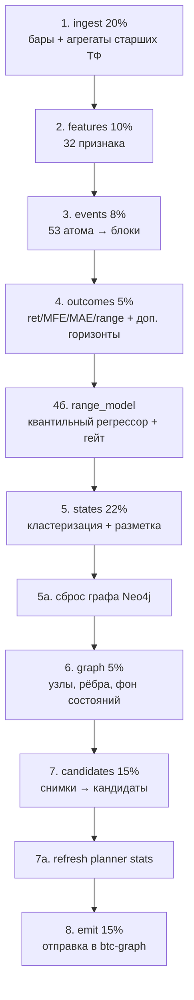

# Глава 15. Конвейер: train и live

> **Кратко.** Два режима работы, разделённые принципиально: `train`
> переобучает модель состояний с нуля и перенумеровывает всё, `live` загружает
> сохранённую модель и только размечает ею свежие бары. Регулярное обновление —
> всегда `live`. Глава разбирает стадии обоих, объясняет, откуда берутся точки
> продолжения, почему окна намеренно перекрываются и что из этого следует для
> чтения данных.

---

## 15.1. Почему два режима

Модель состояний обучается на всей доступной истории. Если переобучать её при
каждом запуске:

- `group_id` перенумеровываются, и «состояние 7» сегодня не то же, что вчера;
- накопленный в Neo4j граф перестаёт соответствовать реальности;
- прогон занимает 30–60 минут вместо секунд.

Поэтому:

| | `train` | `live` |
|---|---|---|
| Модель состояний | обучает с нуля | загружает последнюю |
| Длительность | 30–60 мин | секунды–минуты |
| Частота | раз в неделю (вс 03:20 UTC) | раз в полчаса |
| Пишет `bar_events` | да | **нет** |
| Пишет `features` | всю историю | только хвост |
| Пишет `bar_states` | всю историю | окно вокруг cutoff |
| Сносит граф Neo4j | да | нет |
| Обучает модель размаха | да | нет, загружает |
| Отправка кандидатов | обычно `--no-emit` | да |

---

## 15.2. Стадии `train`



Проценты — веса стадий в общем прогрессе, который пишется в `runs` и читается
админкой в реальном времени.

Каждая стадия пишет результат в БД под общим `run_id`, поэтому прогон можно
разобрать постфактум: какая модель использовалась, какие переходы получились,
какие кандидаты из них выросли и как их оценил приёмник.

### Порядок не произволен

**Признаки до событий** — потому что события реиндексируются по индексу
признаков: бар без полного набора признаков в разметку состояний не попадает, и
блок событий для него не нужен.

**Исходы до модели размаха** — регрессору нужна цель.

**Модель размаха до кластеризации** — и это принципиально: ей нужны признаки и
бары, но **не нужна разметка**. В этом весь её смысл (глава 13): эффект живёт в
признаках, а не в состояниях.

Падение обучения модели размаха **не роняет прогон**:

```python
except Exception as exc:   # noqa: BLE001 — прогон важнее модели
    logger.exception("Модель размаха не обучилась")
    stats["range_model"] = {"error": str(exc)}
```

Размах украшает кандидата, но не является его частью.

**Сброс графа сразу после сохранения модели** — не перед отправкой. Штатный
недельный `train` идёт с `--no-emit`: кандидатов не шлёт, но модель подменяет, и
ближайший `live` начнёт писать в граф уже новой нумерацией. Привязка очистки к
отправке оставила бы этот путь открытым.

Ошибка очистки **роняет прогон**, а не пропускается: «не получилось почистить, но
модель сохранили» воспроизводит ровно ту проблему, которую очистка закрывает.

**Обновление статистики планировщика после кандидатов.** Прогон только что
дописал сотни тысяч строк, а у новой монеты её `symbol` планировщику вообще
незнаком: он оценивает выборку в одну строку и выбирает планы под одну строку.
Первым это ловит оператор, открывший граф сразу после обучения.

---

## 15.3. Стадии `live`

```
1. добрать свежие бары (ingest с точки max(ts))
2. загрузить модель последнего train ЭТОЙ монеты
3. посчитать признаки на всей истории (нужны модели)
4. разметить всю историю загруженной моделью
5. записать: хвост features, окно bar_states
6. собрать кандидатов от cutoff
7. отправить + разослать уведомления
```

### Признаки считаются на всей истории, а пишется хвост

Модель — это центроиды в пространстве признаков; чтобы разметить свежий бар,
нужен его вектор, а для вектора нужны окна до месяца. Плюс сглаживание и энтропия
траектории смотрят назад.

Но **писать** всю историю не надо:

```python
def features_tail(features, last_stored, cutoff):
    if last_stored is not None:
        return features[features.index > last_stored]
    return features[features.index >= cutoff]
```

PK здесь `(symbol, ts, version)`, и повтор был бы честным upsert'ом тех же чисел
— но триста тысяч строк двенадцать раз в сутки на монету.

Look-ahead здесь не возникает: признаки не заглядывают вперёд, поэтому значение
бара не зависит от того, докуда досчитана история, и строка, записанная сегодня,
совпадает с той, что запишет ближайший `train`.

Историческая справка: до 2026-08-15 `live` признаки **считал, но не сохранял**, и
симптом был виден глазами на каждом графике — нижняя панель признака обрывалась
на дате последнего `train`, а свечи шли до текущего часа.

### Разметка пишется окном, а не целиком

```python
def bar_states_window(states, cutoff):
    margin_bars = (config.states.smoothing_bars
                   + config.states.trajectory_window
                   + ceil(max(SNAPSHOT_OFFSETS_MIN) / base_minutes))
    start = cutoff - pd.Timedelta(minutes=margin_bars * base_minutes)
    return states[states.index >= start]
```

PK таблицы — `(symbol, ts, run_id)`, то есть каждый `live` делает не upsert
поверх старого, а **чистые вставки на весь объём**. При 300 тысячах баров и
прогоне раз в полчаса на три монеты это порядка **30 миллионов строк в сутки**,
которые не удаляет никто.

Технологический запас перед cutoff нужен, чтобы записанный кусок был
самодостаточен для чтения: сглаживание переписывает начало серии задним числом,
энтропия считается по окну траектории, снимки кандидатов смотрят назад на
максимальный офсет.

### Модель ищется среди прогонов этой монеты

```python
source = runs.latest_completed_run("train", symbol)
run_symbol = source.get("symbol")
if run_symbol and run_symbol != symbol:
    raise RuntimeError(f"Прогон #{source['run_id']} обучен на {run_symbol}, "
                       f"а live запущен для {symbol}. Модели несопоставимы.")
```

> ⚠️ **Ломается молча.** Без фильтра по монете `live` для ETH взял бы модель
> последнего `train` вообще — то есть разметил бы бары ETH состояниями BTC.
> Обнаружилось бы это только по бессмысленным кандидатам.

---

## 15.4. Точки продолжения

Берутся **из данных, а не из календаря**.

**Бары** — от `max(ts)` в `ohlcv`.

**Кандидаты** — от последнего выпущенного:

```python
def resolve_cutoff(last_bar, last_candidate, lookback_minutes, max_lookback_days=30):
    if lookback_minutes is not None:
        return last_bar - Timedelta(minutes=lookback_minutes), "окно задано явно"

    limit = last_bar - Timedelta(days=max_lookback_days)
    if last_candidate is None:
        return last_bar - Timedelta(minutes=240), "кандидатов ещё не было"
    if last_candidate < limit:
        return limit, f"последний кандидат старше {max_lookback_days} дней — окно обрезано"
    return last_candidate, f"продолжаем с {last_candidate} (пропуск {gap_hours:.1f} ч)"
```

Почему из данных: запуск в понедельник после пятничного прогона потерял бы все
выходные — бары бы догрузились, а кандидаты по ним нет.

Верхняя граница страхует от первого запуска на давно заполненной базе: без неё
пауза в полгода вылилась бы в разовый выпуск десятков тысяч кандидатов.

Функция возвращает **причину** вместе с границей, и она пишется в лог прогона.

### Явное окно опасно

```python
if last_candidate is not None and last_candidate < cutoff:
    return cutoff, (f"ВНИМАНИЕ: последний кандидат от {last_candidate} старше "
                    f"начала окна — интервал между ними останется без "
                    f"кандидатов НАВСЕГДА.")
```

Явное окно короче фактического пропуска создаёт дыру, которую не закроет уже
никто: кандидаты за интервал не выпустятся, но точка продолжения уедет в свежее
время.

---

## 15.5. Перекрытие окон — намеренное

Окна `live` перекрываются, и это не недосмотр. Безопасность обеспечена тремя
свойствами:

- `candidate_id` **детерминирован**: тот же бар, тот же переход, тот же офсет
  дают тот же идентификатор;
- запись идёт **upsert'ом**;
- `emitted_at` не сбрасывается.

Значит повторно увиденный кандидат обновит свою же строку и не будет отправлен
второй раз.

Единственное, что стоит между перекрытием и дублями у получателя вебхуков, —
захват доставки (раздел 15.8).

---

## 15.6. Блокировки и расписание

На боевом контуре:

```cron
*/30 * * * *  live  --all --skip-if-busy
20 3 * * 0    train --all --no-emit --skip-if-busy
10 5 * * *    fetch-external
…             ingest-metrics
```

`live` и `train` одной монеты блокируют друг друга. Оба стоят с
`--skip-if-busy`: занятая монета пропускается **без ошибки**, точка продолжения
берётся из данных, и следующий запуск догоняет.

### Heartbeat и мёртвые прогоны

Статус `running` снимает только сам процесс. Если процесс убит — OOM killer на
кластеризации, ребут, `kill -9`, — строка остаётся `running` **навсегда**.

Дальше отказ становится тихим: каждый следующий `live` этой монеты молча
пропускается (штатное поведение `--skip-if-busy`, без ошибки и без ненулевого
кода возврата), а в админке мёртвый прогон навсегда занимает слот. Обновление
данных по монете просто прекращается, и заметно это только по растущему
отставанию.

```sql
ALTER TABLE runs ADD COLUMN updated_at TIMESTAMPTZ NOT NULL DEFAULT NOW();
CREATE INDEX runs_running_idx ON runs (status, updated_at DESC) WHERE status = 'running';
```

`update_run` трогает `updated_at` на каждой стадии; прогон, молчащий больше
`RUN_STALE_AFTER_MINUTES` (120), считается мёртвым.

Два часа — заведомо больше самой долгой стадии (кластеризация на полной истории)
и заведомо меньше получасового интервала крона, помноженного на терпение
оператора. Занижать опасно: живой `train` будет объявлен мёртвым, и его слот
отдадут второму прогону той же монеты.

---

## 15.7. Отправка

```python
sql = ("SELECT payload FROM candidates "
       "WHERE (run_id = %s OR (emit_error IS NOT NULL AND {scope})) "
       "AND emitted_at IS NULL ORDER BY ts")
```

Пачками по `SINK_BATCH_SIZE` (200). После каждой пачки:

1. `graph_sink.emit_batch(batch)` — вызов приёмника;
2. `repo.save_evaluations(results)` — сохранение вернувшихся оценок;
3. разметка судеб;
4. рассылка уведомлений;
5. обратная связь по прогрессу.

### Три разные судьбы кандидата

Смешивать их нельзя — это разные события с разными причинами:

| Судьба | Причина | `emitted_at` |
|---|---|---|
| Оценён и принят | — | ставится |
| Отсеян фильтром приёмника | «отсеян фильтром btc-graph» | ставится |
| Ниже локального порога | «оценён, но ниже emit_min_quality» | ставится |
| Ошибка отправки | текст исключения | **не** ставится |

> ⚠️ Ложный диагноз «отсеян фильтром btc-graph» на кандидате, которого приёмник
> как раз принял и сохранил, разводит базы: у приёмника запись есть, у нас
> причина неверная.

**Оценки сохраняются до локального порога.** Кандидат, которого приёмник принял
и сохранил у себя, обязан иметь свою оценку и в `processing.candidates`, иначе
базы расходятся, а повторно кандидат не отправляется.

### Добор сорвавшихся отправок

```python
retry_failed = True   # по умолчанию
```

Добираются кандидаты **той же модели**, у которых прошлая отправка сорвалась
(`emit_error` есть, `emitted_at` нет).

Раньше их подхватывало само собой: перекрывающиеся окна `live` «перевозили»
кандидата в свежий `run_id`. С тех пор как `run_id` перестал переписываться
(кандидат остаётся за прогоном, который его впервые выпустил), этот путь исчез —
сорвавшаяся отправка залипала бы навсегда, и заметить это можно было бы только
глазами в админке.

Добираются именно **сорвавшиеся**, а не все неотправленные: `train --no-emit`
накапливает десятки тысяч кандидатов без `emit_error`, и первый же `live` после
него принялся бы разгребать этот бэкфилл без спроса, часами.

### Обратная связь обязательна

```python
if on_batch:
    on_batch(0, 0)          # ДО тяжёлого запроса
pending = [row["payload"] for row in fetch_all(sql, params)]
```

Выборка идёт целиком в память: на очереди в 34 тысячи это десятки мегабайт JSONB
и несколько секунд тишины перед первой пачкой. Без сообщения о начале команда
неотличима от зависшей.

---

## 15.8. Уведомления

Третий выход системы, помимо приёмника. `btcproc/notify/` шлёт `POST` с JSON на
адрес из правила.

```
правило = адрес + заголовки + фильтр (монета, рейтинг, сторона,
                                       мин. качество, переходы, семейства событий)
```

Правила живут **в БД**, а не в `.env`: их правит оператор из админки, и
перезапуск процесса ради нового адреса — неприемлемая цена. Механика доставки
(таймауты, число потоков, окно свежести) наоборот живёт в окружении: это свойство
установки.

Формат тела — **внешний контракт**, `docs/notifications.md`, версия схемы лежит
в самом теле.

### Три предохранителя, снимать их поодиночке нельзя

**Окно свежести** (`NOTIFY_MAX_CANDIDATE_AGE_MIN`, 180 минут). `train` выпускает
сотни тысяч кандидатов с 2017 года; без окна первый же полный прогон с отправкой
разослал бы их все — не ошибкой, а по написанному. Возраст режется в SQL: список
id бывает в десятки тысяч.

**Захват доставки.** Пара `(rule_id, candidate_id)` в
`notification_deliveries` через `ON CONFLICT DO NOTHING RETURNING`. Окна `live`
перекрываются намеренно, и это единственное, что стоит между перекрытием и
дублями у получателя. Он же позволяет держать **две** точки рассылки
(`emit_pending` после оценки и конец `run_live` для неоценённых) без условий,
которые бы разъехались.

**Фильтр по рейтингу не срабатывает без оценки.** `rating` и `quality_score`
считает приёмник; «рейтинг неизвестен» — это не «рейтинг подходит».

> ⚠️ Иначе правило «только STRONG» слало бы всё подряд ровно тогда, когда
> приёмник недоступен. Регрессия —
> `test_rating_filter_does_not_fire_without_evaluation`.

### Ретраев нет сознательно

Уведомление про рынок протухает за минуты; доставленное через час, оно вреднее
недоставленного.

### flush перед выходом

Потоки-отправители демонические, а `make live` — крон-процесс. Без ожидания
очередь умирала бы вместе с ним:

```python
notify.flush()   # с дедлайном
```

---

## 15.9. Проигрывание истории без переобучения

`btcproc/analysis/replay.py` — пересборка кандидатов **текущим кодом на
действующей модели**.

Зачем: правку расчёта кандидата надо померить, а `train` для этого не годится —
он переобучит модель, и сравнение будет мерить две разницы сразу.

```
replay(model_run_id) → те же снимки, новый код сборки → кандидаты в память
```

Используется двумя способами:

- `scripts/measure_block_a.py` — парное сравнение «старый код против нового» на
  одних и тех же снимках;
- `scripts/dump_candidates.py` — выгрузка для калибровки профиля.

Второе предпочтительнее выгрузки из таблицы: в таблице лежит смесь прогонов
разных версий сборки кандидата, а replay даёт однородную выборку одной моделью и
одним кодом.

---

## 15.10. Что из устройства конвейера следует для чтения данных

Три следствия, каждое обжигало.

### `bar_events` штатно отстаёт

`live` в таблицу событий не пишет вовсе. Поэтому она отстаёт от `ohlcv` на срок
до недели — до ближайшего воскресного переобучения.

- замер лифта по атомам идёт по данным **до последнего `train`**, а не до
  сегодня;
- новый или изменённый контекстный атом не появляется на свежих барах сам:
  историю закрывает `scripts/backfill_context_atoms.py --force --all`, а хвост —
  ближайший `train`;
- «в `bar_events` данные трёхдневной давности» — **не диагноз**. Сверять надо с
  датой последнего `train` монеты.

### Кандидаты `train`-прогона in-sample по определению состояний

Модель обучалась на всей истории, включая будущее этого бара. Поля размаха у них
пустые всегда, маркеры на графике идут отдельным слоем (глава 8.8).

### `run_id` — это запуск, а не модель

Одна модель живёт в своём `train` и во всех `live`, которые её загрузили. Всё,
что сравнивает или агрегирует записи разных прогонов, обязано пользоваться
`runs.model_run_scope()`.

> ⚠️ Игнорирование дало два тихих бага сразу: замер, смешавший шесть моделей, и
> админку, замиравшую на моменте последнего обучения.

---

## 15.11. Обслуживание

`scripts/maintenance.py` (`make maintenance`), еженедельно в кроне:

1. удаление **копий** разметки бара внутри одной модели, оставшихся от
   перекрывающихся окон `live`;
2. вакуум.

> ⚠️ **Ломалось молча.** Прежнее правило — «оставить N последних live-прогонов» —
> сносило единственную разметку хвоста истории: свежие бары размечал ровно один
> прогон, и он же оказывался N+1-м. Покрытие баров разметкой пропадало без единой
> ошибки.

Плюс `scripts/prune_runs.py` — удаление лишних моделей состояний из базы (по
умолчанию сухой прогон), с сознательной защитой live-прогонов действующей модели.

---

## 15.12. Резюме главы

`train` строит, `live` применяет. Разделение продиктовано тем, что модель
состояний перенумеровывает всё при каждом обучении, а накопленный граф этой
нумерации соответствовать перестаёт.

Три механизма, обеспечивающих устойчивость: точки продолжения берутся из данных
(пропуск догоняется сам), окна перекрываются (ничего не теряется), детерминированный
`candidate_id` плюс upsert (перекрытие безвредно).

Три предохранителя уведомлений закрывают три разных способа разослать не то:
исторический бэкфилл, дубли при перекрытии, срабатывание фильтра без данных.

И одно свойство, которое надо помнить при любом анализе: `bar_events` отстаёт от
остальных таблиц по устройству контура, а не по поломке.

Следующая глава — как всё это работает на шести монетах сразу.
