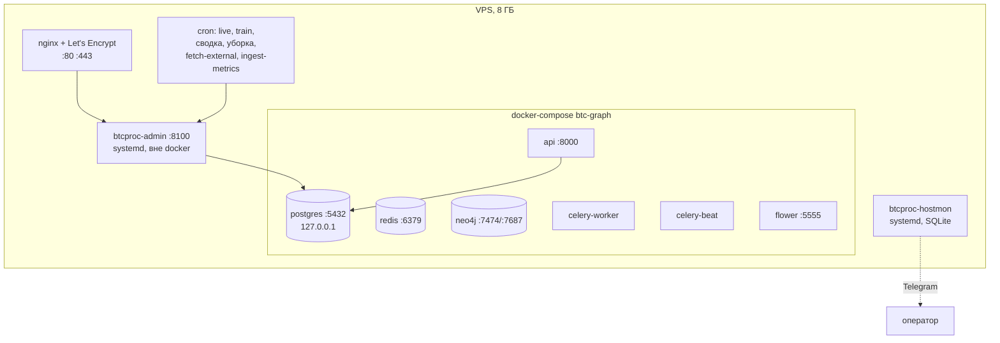

# Глава 17. Эксплуатация

> **Кратко.** Один VPS, docker-стек приёмника, админка генератора под systemd,
> отдельный монитор машины в SQLite, кроны, nginx с сертификатом. Два скрипта
> развёртывания с локальной машины. Глава разбирает эксплуатационный контур,
> девять страниц админки, диагностику базы и типичные отказы — включая те, что
> не дают ошибок.

---

## 17.1. Что где работает



Наружу открыты только 22, 80 и 443. Всё остальное — на `127.0.0.1`.

Порты заданы **в самом `docker-compose.yml`**, а не через override-файл: списки
`ports` при слиянии compose-файлов *склеиваются*, поэтому override добавил бы
второй биндинг рядом со старым, а не заменил его.

---

## 17.2. Развёртывание: два скрипта

Оба запускаются **с локальной машины** и ходят на сервер по ssh.

### `01_deploy.sh` — инфраструктура и код

1. проверяет сервер (ОС, sudo, ssh) — **до** того, как что-то менять;
2. системные пакеты, Docker, пользователь в группу `docker`;
3. `rsync` обоих проектов в `/opt/crypto-graph`;
4. проверяет, что 8000 и 5555 закрыты на `127.0.0.1`;
5. собирает **один общий venv** на оба проекта;
6. собирает docker-образы;
7. прогоняет тесты обоих проектов **на сервере**;
8. пересобирает уже запущенные контейнеры, накатывает миграции, перезапускает
   админку.

Ничего не запускает и `.env` не создаёт. Повторный запуск безопасен.

`--code-only` — «выкатить свежий код»: rsync, зависимости, тесты, пересборка,
миграции, рестарт. Не трогает пакеты, часовой пояс, swap, docker, ufw, `.env` и
кроны. `pip install` запускается, только если менялся `requirements.txt`
(отпечаток в `venv/.requirements.md5`).

Порядок в конце важен: **контейнеры → миграции → админка.** `alembic` живёт
внутри контейнера `api` и на старом образе не увидит новых ревизий, а админка
должна стартовать на уже мигрированной схеме.

### `02_configure.sh` — конфигурация и запуск

1. `.env` обоих проектов (пароль админки и `ADMIN_SECRET_KEY` генерируются);
2. обёртка `bin/btcproc` — правильный интерпретатор и cwd;
3. поднимает стек и **ждёт healthcheck**, а не «контейнер запущен»;
4. миграции: alembic, граф Neo4j, схема `processing`;
5. ufw;
6. админка и монитор ресурсов как systemd-сервисы;
7. nginx + Let's Encrypt, после чего админка уезжает на `127.0.0.1`;
8. **обучение монет** из `TRAIN_SYMBOLS`, по одной подряд;
9. и только после успеха всех — кроны и logrotate.

### Один venv на оба проекта

Не экономия места, а **требование `SINK_MODE=direct`**: генератор импортирует
пакет приёмника как библиотеку, и `pgvector` с `neo4j` обязаны лежать в том же
интерпретаторе (глава 2.4).

### Ловушка `TRAIN_SYMBOLS`

> ⚠️ **Это полный список монет контура, а не «что доучить».** Переменная
> работает на два шага сразу: шаг 8 обучает из неё только необученные монеты, а
> шаг 9 собирает из неё **всё расписание заново**.

`TRAIN_SYMBOLS="SUIUSDT"` при добавлении монеты означает не «доучи SUI», а «в
кроне остаётся только SUI» — остальные выпадут из `live` и `train` **без единой
ошибки**, просто перестав обновляться.

Защита: шаг сверяет переменную с обученными монетами в базе и падает с готовой
командой, если кто-то потерялся. Осознанный вывод монеты подтверждается флагом
`--drop-symbols`.

Первая монета списка попадает в `.env` как `SYMBOL` — монета по умолчанию для
одиночных команд, поэтому BTCUSDT держат первым.

Уже обученная монета пропускается: `train` переобучает модель с нуля, и
накопленный граф смешал бы две нумерации. Для осознанного переобучения —
`--retrain`.

---

## 17.3. Админка: девять страниц

FastAPI + Jinja + HTMX, без сборки фронтенда. Запускается под systemd в том же
процессе, что и фоновые прогоны (`BackgroundTasks`).

| Страница | Что показывает |
|---|---|
| **Сводка** | покрытие истории, отставание, последние прогоны, лента кандидатов по всем монетам |
| **Граф** | Cytoscape.js: узлы-состояния, рёбра-переходы, панель деталей с фоном состояния |
| **График** | свечи, раскрашенные состояниями; гистограмма объёма; панель признака; инспектор бара |
| **Состояния** | полный список состояний модели с цветами палитры |
| **Кандидаты** | таблица с фильтрами по монете, рейтингу, стороне, переходу |
| **Прогоны** | список с прогрессом и логом в реальном времени |
| **Сервер** | нагрузка хоста, контейнеры, живой срез запросов PostgreSQL |
| **Уведомления** | правила вебхуков, журнал доставок |
| **/help** | шпаргалка оператора |

`/help` — выжимка из `operator_guide.md` и не заменяет его: процедуры (заведение
монеты, калибровка профиля) остаются в инструкции.

### Размах в интерфейсе (с 2026-08-24)

Единственная измеренно работающая величина проекта до этой даты нигде не
показывалась: `range_lift` и квантили считались, доезжали до кандидата и
лежали в базе. Теперь они видны в трёх местах — колонка «Размах» в таблице
кандидатов и в ленте сводки, блок из двух карточек в карточке кандидата.

Три решения, каждое следует из замеров, а не из вкуса:

* **блок стоит ВЫШЕ оценки.** Оценка говорит о направлении, а про направление
  измерено, что система его не предсказывает (глава 18.2). Ставить проверенную
  величину ниже непроверенной значило бы расставлять акценты против
  собственных замеров;
* **в таблицах — только относительная величина.** Абсолютные
  `expected_range_ratio_*` наполовину объясняются часом дня и недавней
  волатильностью (глава 13.6), то есть в строке таблицы выглядели бы
  содержательнее, чем являются. В карточке они показываются второй карточкой
  и с оговоркой: там есть место написать предложение;
* **пустое значение подписано словами.** Кандидаты `train` полей размаха не
  несут по построению, у монет без калиброванной модели их нет вовсе — и таких
  кандидатов большинство. Прочерк без объяснения оператор читает как сломанный
  расчёт и идёт чинить работающее.

Колонки тянутся запросом (`queries.RANGE_COLUMNS`), а не разворачиванием
`payload` в шаблоне: в шаблоне отсутствующий ключ молча превращается в пустую
строку, и «модель ничего не сказала» становится неотличимо от «поле потеряли».

### График: почему панель признака читает БД

Под свечами — панель одного признака **из набора модели прогона**
(`state_models.feature_ver` → `feature_sets.names`), и значения читаются из
таблицы `features`.

> Пересчитывать индикатор на клиенте нельзя: он разойдётся с моделью. Признак
> `rv_rank` в браузере на видимом окне и `rv_rank`, посчитанный на полной
> истории, — разные числа.

Атомы в инспекторе бара разделены на signature и контекстные **визуально**:
первые входят в `event_block_id`, вторые нет, и одинаковыми в интерфейсе они
выглядеть не должны.

### Цвета

Генерируются на сервере **в hex**: lightweight-charts падает на `hsl(...)` с
«Cannot parse color». По той же причине прозрачность заливок считается из hex
вручную — `color-mix(...)` библиотека тоже не понимает.

Палитра **одна на модель** (`queries.state_palette`), её берут и график, и
список состояний. По окну графика цвет не считается: он перестал бы быть
узнаваемым.

### Правило «админка не считает агрегаты на клик»

Инвариант 19, разобран в главе 8.6. Величина, неизменная после завершения
прогона, считается один раз в `train` и хранится.

Два предохранителя поверх:

```python
admin/single_flight.py     # схлопывает одинаковые параллельные запросы
queries.fetch_all(...)     # statement_timeout = 60 c
```

**Потолок задаёт вызывающий и никогда — пул**: в том же процессе фоновые потоки
гоняют `train` с bulk-вставками на десятки минут.

### Ловушка Jinja

> ⚠️ Ключи словарей, уходящих в шаблоны, не называются именами методов `dict`
> (`items`, `keys`, `values`, `get`). Jinja сначала пробует `getattr`, поэтому
> `containers.items` резолвится в метод, а страница падает с «object is not
> iterable».

---

## 17.4. Мониторинг машины

`btcproc/hostmon/` — отдельный контур, устроенный нарочито в стороне.

```
btcproc.cli hostmon (systemd btcproc-hostmon)
  → раз в минуту: psutil + docker stats
  → logs/hostmon.sqlite
  → страница /server
  → пороги → Telegram
```

**SQLite, а не PostgreSQL.** Монитор обязан работать, когда стек лежит — именно
тогда он и нужен.

**Файл вне каталогов подпроектов** — `01_deploy.sh` гонит их `rsync --delete`.

**Telegram, а не вебхуки.** С уведомлениями о кандидатах общего нет ничего: там
внешний контракт с версией схемы, здесь короткий текст оператору о машине.

### Антиспам из трёх частей

Инвариант 18, части **не взаимозаменяемы**:

| Часть | Значение | Что закрывает |
|---|---|---|
| `cooldown` | 5 мин | частоту напоминаний |
| `hysteresis` | 5 п.п. | метрику у порога, шлющую пары «сработало/отпустило» |
| `sustain` | 5 замеров для CPU/load | штатные потолки процессора при кластеризации |

> Уберёшь гистерезис — cooldown не поможет: каждое событие формально новое.
> Уберёшь выдержку — уведомление будет приходить на каждый `train`.

Состояние правил лежит **в SQLite**, а не в памяти процесса: иначе перезапуск
сервиса = повторная рассылка про известную проблему.

---

## 17.5. Диагностика PostgreSQL

Страница `/server/postgres` (клик по контейнеру `btc_postgres`).

Показывает:

- **разбор памяти** на разделяемую и приватную;
- **настройки с источником** — откуда пришло значение (файл, командная строка,
  `ALTER SYSTEM`);
- **временные файлы** — сортировки, не влезшие в `work_mem`;
- **топ запросов** по суммарному времени (`pg_stat_statements`).

Плюс `/server` — живой срез активных запросов с возможностью снять зависший
бэкенд, порог подсветки `ADMIN_PG_SLOW_SECONDS`.

### История с двумя гигабайтами

Разобрана в главе 2.7: `timescaledb-tune` выставил `shared_buffers=1985MB` и
оставил `autovacuum_work_mem` наследовать `maintenance_work_mem=993MB` — при
десяти воркерах до 9.7 ГБ на восьмигигабайтной машине.

Обе величины переопределены **в `command` сервиса** (512 МБ и 128 МБ). Три
способа сломать это молча перечислены там же.

---

## 17.6. Регулярные операции

```cron
*/30 * * * *   live --all --skip-if-busy
20 3 * * 0     train --all --no-emit --skip-if-busy
10 5 * * *     fetch-external
…              ingest-metrics
…              maintenance (еженедельно)
…              сводка (раз в сутки)
```

### Три команды, ходящие в чужой API

`fetch-external` (Fear & Greed), `ingest-metrics` (деривативы Binance USD-M) и
`ingest-depth` (снимки стакана) стоят **вне** `train`/`live` намеренно: сетевой
поход не должен ронять или замедлять регулярный расчёт. Прогоны только читают
таблицы — а `depth_snapshots` не читают вовсе.

> ⚠️ **Ломается молча.** Если включить `FGI_ENABLED` или `DERIV_ENABLED`, не
> заведя соответствующую команду в крон, ряд протухнет без единой ошибки в
> логе: свежие бары начнут получать `False`/`NaN`.

Цена решения принята сознательно.

### `ingest-depth`: единственная команда, копящая данные впрок

Заведена 2026-08-24 и оценивается не по тем меркам, что остальные. Она ничего
не даёт сейчас и заведена не потому, что от неё чего-то ждут, а потому, что её
данные **невозможно докупить**: биржи отдают глубину только «на сейчас»,
исторических дампов стакана нет ни платных, ни бесплатных. Свечи за 2018 год
скачиваются одной командой; стакан за вчера — уже нет.

Отсюда порядок, обратный обычному: решение «копить» принимается раньше решения
«полезен ли». Через год накопленного хватит, чтобы проверить второе; не начав
сегодня, через год будет ровно то же положение, что сейчас.

Практика: раз в минуту, шесть монет, 20 уровней с каждой стороны, около 8.6
тыс. строк в сутки на монету (19 млн строк в год суммарно). Сырые уровни
кладутся в JSONB целиком — посчитать дисбаланс из уровней можно всегда,
восстановить уровни из дисбаланса нельзя, а какие агрегаты понадобятся через
год, сейчас не знает никто.

Три решения против тихого сбоя:

* **время берётся по часам этой машины**, а не из ответа биржи: Binance отдаёт
  `lastUpdateId` без времени, Bybit — свой `ts`, и складывать две шкалы в одну
  колонку хуже, чем иметь одну свою с известной погрешностью;
* **пустая сторона стакана — не ноль, а сломанный ответ**, и в базу не идёт: у
  торгуемой пары обеих сторон пустыми не бывает, а через год отличить одно от
  другого будет нечем. У Bybit сюда добавляется, что ошибка приезжает **кодом
  200 с ненулевым `retCode`**;
* **ноль снимков — ненулевой код возврата**: одна недоступная монета не
  отменяет остальные, но если не ответила ни одна, крон обязан узнать об этом
  — иначе ряд рвётся молча ровно там, где его непрерывность и есть весь смысл.

Запрет, действующий до отдельного ТЗ: **никаких признаков, атомов и гейтов из
этих данных не заводится**, и ни `train`, ни `live` таблицу не читают.

### Уборка

`make maintenance` еженедельно: удаление копий разметки бара внутри одной модели
+ вакуум (глава 15.11).

---

## 17.7. Типичные отказы

Таблица составлена по реально случавшимся, а не по воображаемым.

| Симптом | Вероятная причина | Проверка |
|---|---|---|
| `live` не добирает свежие бары | Binance 451 на US-хосте | `BINANCE_REST_URL` → `data-api.binance.vision` |
| Кандидаты считаются, записей нет | разъезд интерпретаторов в `direct` | `btcproc.cli status` |
| Монета перестала обновляться | мёртвый прогон в статусе `running` | `runs` где `status='running'` и старый `updated_at` |
| Все кандидаты монеты WEAK | профиль оценки | `config/symbols/<SYM>.yaml`, не генератор |
| У монеты 5 состояний вместо 40 | пороги кластеризации | `states_overrides` в `symbols.py` |
| `bar_events` отстаёт на дни | **не поломка** | сверить с датой последнего `train` |
| Задачи копятся в Redis | воркер без `-Q evaluate,celery` | `celery inspect active_queues` |
| Правка настройки Postgres не подействовала | `ALTER SYSTEM` против аргументов командной строки | `command` в compose |
| Атомы источника всегда `False` | флаг включён, крон не заведён | `external_daily` / `deriv_metrics` |
| Панель признака обрывается на дате `train` | было до 2026-08-15 | `live` пишет хвост `features` |
| Открытие узла графа кладёт базу | было до 2026-08-16 | агрегат в `state_context` |

### Скилл проверки

`.claude/skills/system-sanity-check/` — процедура разбора «действительно ли
что-то сломалось, или система ведёт себя штатно, а выглядит как поломка».

Требует показать **факты из логов и БД**, а не мнение или впечатление от
картинки. Типичные входные запросы: «кандидаты пропали», «после `train`
кандидатов нет», «в дашборде всё по нулям», «граф состояний развалился».

Половина таких обращений закрывается объяснением устройства контура, а не
починкой.

---

## 17.8. Безопасность

Честный список.

**API приёмника без аутентификации и rate-limit.** `use_llm=true` тратит токены
Anthropic по анонимному запросу. Допустимо только потому, что порт закрыт на
`127.0.0.1` и наружу не выставлен.

**`POST /config/reload` закрыт за флагом** `ENABLE_CONFIG_RELOAD=false`: ручка
меняет поведение скоринга на лету.

**Админка генератора** — сессии, rate-limit по IP, allowlist, пароль и
`ADMIN_SECRET_KEY` генерируются при развёртывании. Значения-заглушки из
`.env.example` проверяются на старте: с ними админка не поднимется.

**nginx + Let's Encrypt** перед админкой; после установки прокси она уезжает на
`127.0.0.1`, и 8100 закрывается.

**ufw**: наружу только 22, 80, 443.

---

## 17.9. Тесты

Оба проекта тестируются **без инфраструктуры**: ни БД, ни Redis, ни Neo4j, ни
ключа Anthropic.

```bash
cd btc-graph            && make test-local
cd btc-graph-processing && make test
```

**Приёмник.** `conftest.py` уводит `DATABASE_URL` на in-memory sqlite (до
первого импорта `src.db.*`, который создаёт engine прямо на импорте) и подменяет
заглушками отсутствующие SDK — заглушка ставится **только если реального пакета
нет**.

**Генератор.** Данные генерирует `make_bars()` — синтетические свечи с
чередующимися режимами, чтобы кластеризации было что находить.

### Что стоит знать про прогон тестов

**Два интерпретатора.** Версии pandas/numpy расходятся, и часть багов
(read-only массив из `to_numpy()` на pandas 3, `NaN` вместо `None`)
воспроизводится только на свежих библиотеках.

**Флаги источников.** Дефолты вычисляются на импорте из окружения процесса, и на
боевом VPS «конфигурация по умолчанию» означает «включён». Тест, сверяющийся с
`SMCConfig()`, зеленеет локально и падает при выкатке. Так уже ловились два
теста.

```bash
FGI_ENABLED=true SMC_ENABLED=true python3 -m pytest
```

### Три теста, которые стоит знать по именам

| Тест | Что стережёт |
|---|---|
| `test_scorer_snapshot.py` | рефакторинг не сдвинул числа BTC (200 кандидатов) |
| `test_sanity_candidates.py` | монету нельзя завести без якоря |
| `test_dedup_does_not_leak_between_symbols` | ETH не получает оценку BTC |

Плюс контракт схемы: `test_generated_candidates_match_btc_graph_schema` в
генераторе импортирует pydantic-модель приёмника.

> ⚠️ **Ломалось молча.** При неверном `BTC_GRAPH_PATH` этот тест **скипался**, и
> контракт схемы переставал проверяться незаметно. Дефолт пути теперь вычисляется
> от расположения `config.py`, а не хардкодится.

**Непокрыто** (нужен живой стек): репозитории PostgreSQL, Cypher-запросы, SQL к
continuous aggregates, HTTP-роуты, Celery-задачи.

---

## 17.10. Резюме главы

Контур рассчитан на один VPS и на оператора, который заглядывает в него
несколько раз в неделю. Отсюда конструктивные решения: собственная админка
вместо трёх сервисов мониторинга, монитор машины в файле вместо базы, кроны с
`--skip-if-busy` вместо очереди задач.

Больше половины эксплуатационных проблем в истории проекта — тихие: атомы,
ставшие `False`; монета, выпавшая из расписания; прогон, залипший в `running`.
Против каждой заведена либо проверка на старте, либо строка в таблице отказов,
либо явное сообщение в логе.

Правило, к которому это сводится: **если что-то может сломаться без ошибки, оно
обязано либо падать, либо печатать причину.**

Следующая глава подводит итог всему измеренному.
